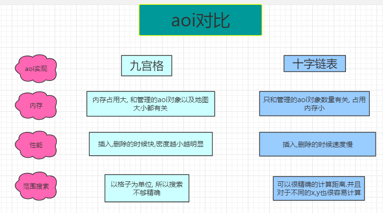

##### aoi 比较  

所谓 AOI ( Area Of Interest ) ，就是只需要关心自己感兴趣范围内的变化(xx加入,xx消失,xx 移动)

因为一张地图非常大, 会有很多自己不需要关心的对象.   如果不用区域划分, 管理这些对象的成本会非常高

目前有两种划分方法.  **网格和十字链表**

十字链表适合不同的xy. 并且距离判定比较精准.  但是插入,删除效率不如九宫格.(见最后面的测试数据)

九宫格占用内存大，因为每个格子都有一个兴趣列表，大地图格子多，人很少的情况下就会造成大量的浪费。 十字链表占用内存少，有多少人，链表就多长。

网格(灯塔): 将地图划分成多个等分的, 某种形状的格子(目前一般是矩形 , 也可以是多边形).  节点会落在其中的某个格子上. 每个格子称为一个灯塔.上面会有集合保存格子上面的对象标识(label)

十字链表: 在x轴y轴上, 使用单链表或者双向链表来将各个节点有序的串联起来

上面这张图会被表示成下面的链表

x轴  xHead->1->2->3->5->6->xTail(反向也有个链接, 这里没画)

y轴(一般在左上角)  yHead->6->5->3->2->1-> yTail (反向也有个链接, 这里没画)

实现:

九宫格 : 

1. 添加, 删除

   

   某个对象A被添加进aoi的某个格子(T) 的时候(可能是直接落在, 也可能是从别的格子移动到某个 首先会得到格子T(以下称为Tower).   然后获取从X(Tx -1, Tx+1), Y(Ty-1, Ty+1)的最多九个格子中的所有对象集合Ps.  遍历Ps, 将A和Ps集合中的每个对象P, 都建立起某种关系(AddRelation)

   删除是同理的. 某个对象A被从Aoi移除的时候(从场景移除, 或者离开某个T) .  遍历Ps, 将A和Ps集合中的每个对象P, 都移除某种关系(RemoveRelation)

2. 移动更新

   

   见上图.  (左上角为原点)  当对象A从(2, 2) 移动到(3,2)的时候.   对于old格子(Told)里面的所有对象Ps来说,  双方会进行移除关系操作(RemoveRelation), 对于new格子(Tnew)里面所有的对象Ps来说.  双方会进行添加关系操作(AddRelation).  同时, 对于 old和new中间的绿色格子所有对象来说,  他们会看到A从(2,2)移动到(3,2)

十字链表: (这里只做了基本的实现, 没有优化. )

通用方法, 记为 F  从某个对象A的位置  Ax, AY起,  向x轴的前后, y轴的上下遍历每个节点P,   将满足 abs(Px, Ax) <= xRange && abs(Py, Ay) <= yRange的点P, 加入到集合Set中.

1. 添加, 删除

   某个对象A被添加进aoi的时候. 分别从xHead和YHead开始, 依次比较x,y的大小, 将A对象插入合适的链表位置.  然后对A进行F方法的调用. 得到集合Set.  对set中的每个对象P, 和A建立关系(AddRelation),或者删除关系(RemoveRelation)

2. 移动更新

   

   当某个对象A从old移动到new的时候.(比如上面的3,3 移动到4,4) .   使用F函数对 old, new分别计算得到 SetOld, SetNew.   

   将SetNew-SetOld得到移动通知集合SetDiff. 将SetNew-SetDiff得到新增集合SetAdd,  将SetOld-SetDiff得到移除集合SetRemove

   分别对三个集合中的对象, 和A进行相应关系的处理

测试数据得到的结论. 

添加删除: **密度(格子数/节点数)越大, 双方越接近.    密度越小, 九宫格算法越有优势**

移动:   效率很接近

类图

部分代码  [aoi 部分代码.html](aoi 部分代码.html)

使用新节点方式处理后添加的测试数据   [aoi测试数据.xlsx](aoi测试数据.xlsx)

#### 优化: 

1. ##### aoi分层(梦幻西游手游做法, 这里并没有实现)
   
   1. 有了AOI算法，并不意味着能有满意的效果，假设场景里面放入10000人，那么按分布情况来说，即使有AOI算法，也会很糟糕，你会看到满屏幕的人，密密麻麻，卡的要死。这种情况下，玩家体验会很糟糕，所以可能需要进一步优化。
   2. 从梦幻西游手游服务器AOI设计方案中看到的，设计一个分层AOI概念，也就是单个场景创建多个AOI对象。把玩家分通过某个规则，分在不同的层次。当人数增多时，可以动态进行分层，人数少的时候可以把层数合并回来，然后就是让玩家在人少的时候也能看到几个人，人多的时候还是看到几个人。
   3. 这里其实说的是一个概念.   aoi只负责筛选集合, 当双方addRelation的时候, 不能全部都建立关系.  比如筛选出了100个人, 但是机器只支持显示10个人.
      1.  那么是哪10个人和我AddRelation. 有没有优先级
      2.  必须满足 当释放技能(或者其他互动)的时候, 也只会有这10个对象会收到事件. 
      3.  其中一个人离开了我的relation, 能不能有策略立即补上这缺少的一个人.  (需要一个补充策略. 或者优先级策略)
      4. 我离开了这100个人的范围, 再回来的时候(离开再返回). 如果原来100个人没动过, 我看到还是这10个人, 还是从100个人再次随机10个人和自己建立关系. 是否有优先的绑定关系?
      5.  上述都属于一个对aoi扫描到的对象建立关系的选择策略.
          1.  可以使用aoi分层
          2.  **可以使用对象身上的某个类来进行管理和选择**(不良人项目使用的方式)
   
2. 优化十字链表查找结构. 提出几种数据结构
   1. 模仿跳表, 建立一个快查链表(隔几个节点建立一个连接).   **但是这种缺点是较难维护, 并且也要从头遍历. 并且很难保证概率相等**
   2. 模仿九宫格. 将地图划分为格子. 插入的时候首先定位是哪个格子, 然后再插入.   这种方式的好处是, 类似于九宫格, 很容易实现九宫格能实现的优化. 

      **目前是用这种方式来进行实现的:**

      2. 在x, y 上面使用数组等分出n个index节点(暂定scala大小).  每个index节点都会有一个first指针, 分别会和自己下面的第一个节点建立双向引用. 用于快速查找定位
      3. 其他的十字链表结构不变. 
      4. 插入的时候. 比如x轴,  首先计算会插入到哪个index节点之后, 然后跳到那个index节点进行插入逻辑.
         1. 如果index节点下面没有. 则插入
      2. 根据index节点下面的first节点. 来进行快速查找定位
      5. 删除的时候, 需要注意是否自己和index节点有引用关系. 如果有, 还需要删除该引用.并将next重新和index节点建立关系   
   6. 移动的时候同理. 也需要同步更新 index节点下的第一个节点的引用
   
3. 九宫格为什么不准
   
   1. 
   2.  如上图.  当玩家在一个格子的左上角, 和右下角的时候. 根据规则筛选出来的格子是不会改变的. 但是离其他玩家的距离却实在的发生了改变. 所以不准
   3. 但正是因为如此,  九宫格在移动的时候可以有优化.  如果玩家移动没有跨越格子的时候, 是不需要重新筛选玩家列表的. (但是这就要求玩家身上有上次筛选的结果集缓存)
   4. 十字链表如果要求距离准确, 那么位置发生改变后, 就必须每次都重新筛选.  如果十字链表也不需要要求太准确, 那么也可以进行九宫格的类似优化.(比如基于上面的index节点优化, 也可以得到当移动没有跨越index节点的时候, 不进行相关relation的更新)
   
4. 技能判定.  **由于隐身(隐身的在aoi里面不能攻击), 人数限制(不能同时显示或者和扫到的对象都建立关系), 以及特殊逻辑(组队, 或者其他全屏可见)等原因. 最好不使用aoi, 而是使用双方维持的关系, 来进行判定**

   1. aoi模块中传入一个 关系策略类(假定叫AoiRelationStrategy).  aoi用它来管理对象之间关系的建立, 删除. 每个对象上面也有个 管理和其他对象关系的类(AoiRelation).
   2. 对象可以在进行技能攻击的时候 , 使用AoiRelation来进行目标判定的遍历.(传入一个技能选择的策略, 返回一个对象组)
   3. 因为这里只讨论aoi的筛选过程, 所以并没有仔细思考AddRelation, RemoveRelation的策略. 目前不良人使用的方式是对象上会有一个集合管理和自己AddRelation的对象. 当技能和移动的时候, 会遍历广播给这个集合中所有对象.