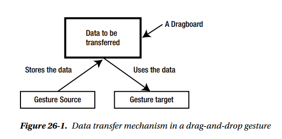
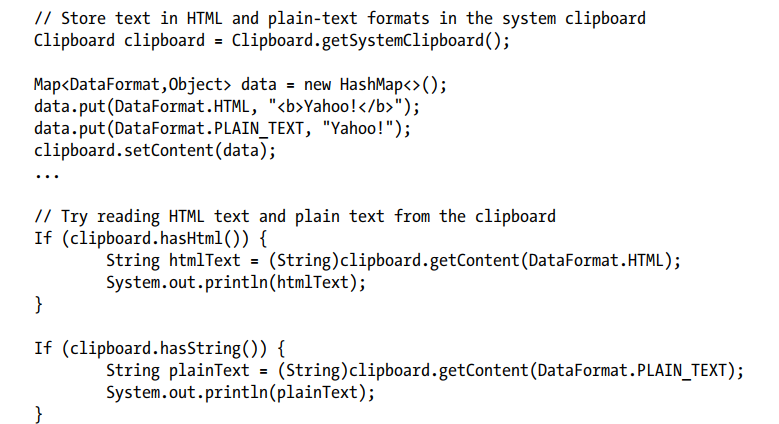
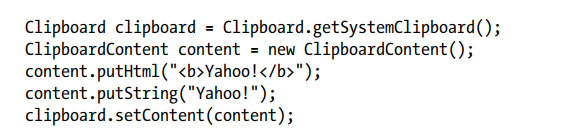
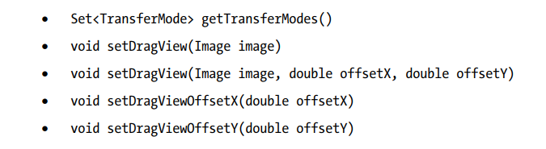
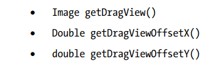

### Drag And Drop

1. 什么是 Press-Drag-Release Gesture(姿势, 手势) ?  
2. **是用户按下鼠标按钮，拖动鼠标与按下的动作按钮，然后松开按钮。手势可以在场景或节点上启动**。几个节点和场景可参与单一的按-拖-释放手势。该手势能够生成不同类型的事件并将这些事件交付给不同的节点。所生成的事件和节点的类型事件取决于手势的目的。一个节点可以拖动不同的目的:
   1. 您可能希望通过拖动节点的边界来改变节点的形状，或者通过拖动节点到新的位置来移动节点。在这种情况下，手势只涉及到一个节点:启动手势的节点。
   2. 您可能希望拖动一个节点并将其拖放到另一个节点上，以某种方式连接它们，例如，用流程图中的符号连接两个节点。在本例中，拖动手势涉及多个节点。将源节点拖放到目标节点时，将发生一个操作。
   3. 您可以拖动一个节点并将其拖放到另一个节点上，以便将数据从源节点传输到目标节点。在本例中，拖动手势涉及多个节点。在删除源节点时发生数据传输。
3. JavaFX支持三种类型的拖动手势:
   1. 一个简单的按-拖-放手势
   2. 一个完整的按-拖-释放手势
   3. 拖放手势
4. 本章将主要关注第三种手势:拖放手势。要全面了解拖放手势，必须了解前两种手势。我将通过每种类型的一个简单示例简要讨论前两种类型的手势。

##### A Simple Press-Drag-Release Gesture

1. 简单的按-拖-放手势是默认的拖动手势. 当拖动手势只涉及到一个节点(即启动该手势的节点)时使用。在拖动手势期间，所有的MouseDragEvent类型(输入鼠标拖拽、拖动鼠标拖拽、退出鼠标拖拽、释放鼠标拖拽)都只传递给手势源节点。在本例中，当按下鼠标按钮时，将选择最上面的节点，并将所有后续鼠标事件交付给该节点，直到释放鼠标按钮为止。当将鼠标拖动到另一个节点时，启动手势的节点仍然在光标下，因此，在鼠标按钮被释放之前，其他节点不会接收事件。

2. 清单26-1中的程序演示了简单的按-拖-释放手势。它增加了两个textfield到一个场景:一个称为源节点，另一个称为目标节点。将事件处理程序添加到两个节点。目标节点添加MouseDragEvent处理程序来检测其上的任何鼠标拖动事件。运行程序，按下源节点上的鼠标按钮，将其拖到目标节点上，最后释放鼠标按钮。下面的输出显示源节点接收所有鼠标拖动事件。目标节点不接收任何鼠标拖动事件。这是一个简单的按下-拖放-释放手势的情况，其中初始化拖放手势的节点接收所有鼠标拖动事件。

3. ```java
   listing 26-1
   
   public class SimplePressDragRelease extends Application
   {
       TextField sourceFld = new TextField("Source Node");
       TextField targetFld = new TextField("Target node");
   
       public static void main(String[] args)
       {
           Application.launch(args);
       }
   
       @Override
       public void start(Stage stage)
       {
           // Build the UI
           GridPane root = getUI();
   
           // Add event handlers
           this.addEventHanders();
   
           Scene scene = new Scene(root);
           stage.setScene(scene);
           stage.setTitle("A simple press-drag-release gesture");
           stage.show();
       }
   
       private GridPane getUI()
       {
           GridPane pane = new GridPane();
           pane.setHgap(5);
           pane.setVgap(20);
           pane.addRow(0, new Label("Source Node:"), sourceFld);
           pane.addRow(1, new Label("Target Node:"), targetFld);
           return pane;
       }
   
       private void addEventHanders()
       {
           // Add mouse event handlers for the source
           sourceFld.setOnMousePressed(e -> print("Source: pressed"));
           sourceFld.setOnMouseDragged(e -> print("Source: dragged"));
           sourceFld.setOnDragDetected(e -> print("Source: dragged detected"));
           sourceFld.setOnMouseReleased(e -> print("Source: released"));
   
           // Add mouse event handlers for the target
           targetFld.setOnMouseDragEntered(e -> print("Target: drag entered"));
           targetFld.setOnMouseDragOver(e -> print("Target: drag over"));
           targetFld.setOnMouseDragReleased(e -> print("Target: drag released"));
           targetFld.setOnMouseDragExited(e -> print("Target: drag exited"));
       }
   
       private void print(String msg)
       {
           System.out.println(msg);
       }
   }
   ```

注意，drag-detected 事件是在拖动鼠标之后生成的。MouseEvent对象有一个dragDetect标志，可以在mouse-pressed 和mouse-dragged 事件中设置。如果将其设置为true，则生成的后续事件是drag-detected 事件。默认情况下是在mouse-dragged 事件之后生成它。如果希望在mouse-pressed 事件(而不是鼠标拖动事件)之后生成它，则需要修改事件处理程序:

```java
sourceFld.setOnMousePressed(e -> {
    print("Source: Mouse pressed");
    // Generate drag detect event after the current mouse pressed event
    e.setDragDetect(true);
});
sourceFld.setOnMouseDragged(e -> {
    print("Source: Mouse dragged");
    // Suppress the drag detected default event generation after mouse dragged
    e.setDragDetect(false);
});
```


##### A Full Press-Drag-Release Gesture  

当拖动手势的源节点接收到drag-detected 的事件时，您可以通过调用源节点上的startFullDrag()方法来启动完整的press-dragrelease手势。startFullDrag()方法存在于节点和场景类中，允许您为一个节点和场景启动一个完整的press-drag-release手势。在此讨论中，我将只使用术语节点。

Tip:  **startFullDrag()方法只能从拖放检测到的事件处理程序中调用。从任何其他位置调用这个方法抛出IllegalStateException**

您需要再进行一次设置，才能看到完整的“press-drag-release”手势的实际效果。当发生拖动时，拖动手势的源节点仍将接收所有mouse-drag 事件，因为它位于光标下。您需要将手势源的mouseTransparent属性设置为false，这样它下面的节点就会被选中，mouse-drag  事件就会被传递到那个节点。在mouse-pressed  事件中将此属性设置为true，在mouse-released  事件中将其设置为false

清单26-2中的程序演示了一个完整的按-拖-释放手势。该程序与清单26-1中显示的程序类似，除了以下情况:

1. 在源节点mouse-pressed的事件处理程序中，源节点的mouseTransparent属性被设置为false。在mouse-released 事件处理程序中，它被设为true。

2. 在drag-detected  事件处理程序中，在源节点上调用startFullDrag()方法。

运行程序，按下源节点上的鼠标按钮，将其拖到目标节点上，最后释放鼠标按钮。下面的输出显示，当鼠标在其边界内拖动时，目标节点接收mouse-drag   事件。这是完全按-拖-释放手势的情况，发生鼠标拖动的节点接收mouse-drag   事件

```java
public class FullPressDragRelease extends Application
{
    TextField sourceFld = new TextField("Source Node");
    TextField targetFld = new TextField("Target node");

    public static void main(String[] args)
    {
        Application.launch(args);
    }

    @Override
    public void start(Stage stage)
    {
        // Build the UI
        GridPane root = getUI();
        // Add event handlers
        this.addEventHanders();
        Scene scene = new Scene(root);
        stage.setScene(scene);
        stage.setTitle("A full press-drag-release gesture");
        stage.show();
    }

    private GridPane getUI()
    {
        GridPane pane = new GridPane();
        pane.setHgap(5);
        pane.setVgap(20);
        pane.addRow(0, new Label("Source Node:"), sourceFld);
        pane.addRow(1, new Label("Target Node:"), targetFld);
        return pane;
    }

    private void addEventHanders()
    {
        // Add mouse event handlers for the source
        sourceFld.setOnMousePressed(e ->
        {
            // Make sure the node is not picked
            sourceFld.setMouseTransparent(true);
            print("Source: Mouse pressed");
        });
        sourceFld.setOnMouseDragged(e -> print("Source: Mouse dragged"));
        sourceFld.setOnDragDetected(e ->
        {
            // Start a full press-drag-release gesture
            sourceFld.startFullDrag();
            print("Source: Mouse dragged detected");
        });
        sourceFld.setOnMouseReleased(e ->
        {
            // Make sure the node is picked
            sourceFld.setMouseTransparent(false);
            print("Source: Mouse released");
        });
        // Add mouse event handlers for the target
        targetFld.setOnMouseDragEntered(e -> print("Target: drag entered"));
        targetFld.setOnMouseDragOver(e -> print("Target: drag over"));
        targetFld.setOnMouseDragReleased(e -> print("Target: drag released"));
        targetFld.setOnMouseDragExited(e -> print("Target: drag exited"));
    }

    private void print(String msg)
    {
        System.out.println(msg);
    }
}
```


##### A Drag-and-Drop Gesture  

第三种类型的拖放手势称为Drag-and-Drop手势，它是一种用户操作，将鼠标移动与按下的鼠标按钮结合在一起。它用于将数据从手势源传输到手势目标。Drag-and-Drop手势允许从:

1.  One node to another node   一个节点到另外一个节点
2.  A node to a scene   一个节点到场景
3.  One scene to another scene   一个场景到另外一个场景
4.  A scene to a node   一个场景到节点

源和目标可以在同一个Java或JavaFX应用程序中，也可以在两个不同的Java或JavaFX应用程序中。一个JavaFX应用程序和一个本地应用程序也可能参与到手势，例如: 

1. 您可以拖动文本从Microsoft Word应用程序到JavaFX应用程序填充一个文本区域，反之亦然。
2. 您可以拖动图像文件从Windows资源管理器，并将其拖放到ImageView JavaFX应用程序。ImageView可以显示图像。
3. 您可以拖动文本文件从Windows资源管理器，并将其拖放到TextArea JavaFX应用程序。文本区域将读取文件并显示其内容。

**执行拖放手势需要几个步骤:**

	1. 在节点上按下鼠标按钮。
 	2. 按下按钮拖动鼠标。3
 	3. 节点接收到拖放检测到的事件。
 	4. 通过调用startDragAndDrop()在节点上启动一个拖放手势方法，使节点a成为手势源。来自源节点的数据被放置在一个dragboard  中。
 	5. 一旦系统切换到拖放手势，它就会停止传递MousEvents并开始交付DragEvents。
 	6. 手势源被拖到潜在的手势目标上。潜在的手势目标检查是否接受放置在dragboard  中的数据。如果它接受数据，它可能成为实际的手势目标。节点指示是否在其DragEvent处理程序之一中接受数据。
 	7. 用户释放手势目标上按下的按钮，并发送拖放事件。
 	8. 手势目标使用来自dragboard  的数据。
 	9. 一个拖放事件被发送到手势源，表示拖放手势已经完成。

##### Understanding the Data Transfer Modes

在拖放手势中，数据可以在三种模式下传输:

1. Copy   Copy 模式表示数据将从手势源复制到手势目标。你可以拖一个TextField，并把它放到另一个TextField。后者获得前者中包含的文本的副本
2. Move  Move模式表示数据将从手势源移动到手势目标。你可以拖一个TextField，并把它放到另一个TextField。然后将前者中的文本移动到后者
3. Link  Link  模式表示手势目标将创建一个指向正在存在的数据的链接(或引用)转移。“链接”的实际含义取决于应用程序。你可以在链接模式下拖放一个URL到WebView。然后WebView加载URL内容

三种数据传输模式由以下三个常数在TransferMode enum中表示:

•	 TransferMode.COPY
•	 TransferMode.MOVE
•	 TransferMode.LINK  

有时您可能需要三种传输模式的组合。TransferMode枚举包含三个方便的静态字段，它们是枚举常量的数组:

•	 TransferMode[] ANY      ANY字段是COPY, MOVE, and LINK  枚举常量的数组。

•	 TransferMode[] COPY_OR_MOVE     COPY_OR_MOVE字段是复制和移动枚举常量的数组。

•    TransferMode[] NONE    NONE常量是一个空数组。

每个drag-and-drop  手势都使用了TransferMode enum常量。手势源指定它支持的数据传输模式。手势目标指定它接受数据传输的模式。

##### Understanding the Dragboard  

在拖放数据传输中，手势源和手势目标互不认识。实际上，它们可能属于两个不同的应用程序:两个JavaFX应用程序，或者一个JavaFX和一个本机应用程序。如果手势源和目标彼此不认识，那么它们之间的数据传输如何进行?在现实世界中，需要一个中介来促进两个未知方之间的交易。在拖放手势中，还使用了中介来方便数据传输.

Dragboard  充当手势源和手势目标之间的中介。Dragboard  是保存被传输数据的存储设备。手势源将数据放入Dragboard  中;Dragboard  对手势目标可用，因此它可以检查可用于传输的内容类型。当手势目标准备好传输数据时，它从Dragboard  获取数据。图26-1显示了一个Dragboard  所扮演的角色。



Dragboard类的实例表示一个拖板。这个类是从剪贴板类继承的。Clipboard类的实例表示操作系统剪贴板。通常，操作系统在剪切、复制和粘贴操作期间使用剪贴板存储数据。您可以使用clipboard类的静态getSystemClipboard()方法获取操作系统通用剪贴板的引用:

​												Clipboard systemClipboard = Clipboard.getSystemClipboard();  

您可以将数据放在系统剪贴板中，系统中的所有应用程序都可以访问这些数据。您可以读取放在系统剪贴板中的数据，任何应用程序都可以将其放在那里。剪贴板可以存储不同类型的数据，例如，富文本格式(RTF)文本、纯文本、HTML、URL、图像或文件。该类包含几个方法，用于检查剪贴板中是否可用特定格式的数据。如果特定格式的数据可用，这些方法返回true。例如，如果剪贴板包含纯字符串，hasString()方法返回true;对于富文本格式的文本，hasRtf()方法返回true。该类包含以特定格式检索数据的方法。例如，getString()方法返回纯文本格式的数据;getHtml()返回HTML文本;getImage()返回一个图像，以此类推。方法的作用是清除剪贴板。

Tip :  你不能直接创建Clipboard  类的实例。Clipboard  用于存储一个概念项。概念术语是指剪贴板中的数据可以以表示同一项的不同格式存储。例如，您可以存储rtF文本及其纯文本版本。在本例中，剪贴板有同一项的两个不同格式的副本.

剪贴板并不仅限于存储固定数量的数据类型。任何可序列化的数据都可以存储在剪贴板上。存储在剪贴板上的数据具有关联的数据格式。DataFormat类的实例表示一种数据格式。DataFormat类包含六个静态字段来表示常用的数据格式:

•	 FILES  代表文件对象列表 
•	 HTML  html格式的string
•	 IMAGE 平台指定的image类型
•	 PLAIN_TEXT  表示一个纯文本字符串。
•	 RTF  RTF表示一个RTF格式的字符串。
•	 URL   URL表示一个编码为字符串的URL

您可能希望在剪贴板中以上面列出的格式以外的格式存储数据。可以创建DataFormat对象来表示任意格式。您需要为您的数据格式指定mime类型列表。下面的语句以jdojo/person和jdojo/personlist作为mime类型创建一个DataFormat:

​		DataFormat myFormat = new DataFormat("jdojo/person", "jdojo/person");  

Clipboard类提供了以下方法来处理数据及其格式:

•	 boolean setContent(Map<DataFormat,Object> content)
•	 Object getContent(DataFormat dataFormat)  

剪贴板的内容是一个以DataFormat为键、以数据为值的映射。如果剪贴板中不可用特定数据格式的数据，getContent()方法将返回null。下面的代码片段存储HTML和纯文本版本的数据，稍后，检索数据的两种格式:



准备要存储在剪贴板中的数据需要编写一些膨胀的代码。ClipboardContent类的一个实例表示剪贴板的内容，它使使用剪贴板数据变得更容易一些。类继承了HashMap&lt;DataFormat,Object&gt;类。它为常用的数据类型提供了putXxx()和getXxx()形式的便利方法。下面的代码片段重写了上面的逻辑，以便将数据存储到剪贴板中。检索数据的逻辑保持不变。



Dragboard类包含Clipboard类中可用的所有方法。它添加了以下方法:





getTransferModes()方法返回手势目标支持的传输模式集。setDragView()   方法的作用是:将图像设置为拖放视图。图像显示时，手势源拖动。偏移量是光标在图像上的x和y位置。其他方法包括获取拖放视图图像和光标偏移量。

Tip :  dragboard是一种特殊的系统剪贴板，用于拖放手势。您不能显式地创建一个dragboard。每当需要使用dragboard时，它的引用都作为方法或事件对象的属性的返回值可用。例如，DragEvent类包含一个getDragboard()方法，该方法返回包含被传输数据的dragboard的引用

#### The Example Application  

在下面的部分中，我将详细讨论拖放操作的步骤，您将构建一个示例应用程序。应用程序将在一个场景中显示两个textfield。一个文本字段称为源节点，另一个称为目标节点。用户可以将源节点拖放到目标节点上。手势完成后，源节点的文本将被传输(复制或移动)到目标节点。我将在讨论中提到这些节点。它们的声明如下:

