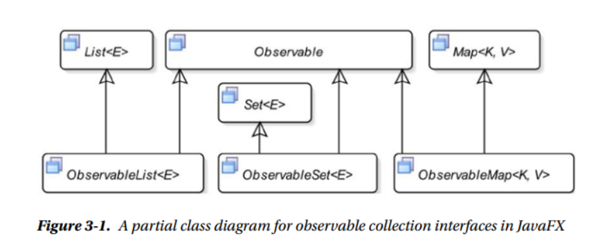

### javaFx ObservableCollection

1.  2个额外的特点
   1.  因为继承了Observable, 所以他们都支持无效化的通知
   2. 他们支持change 通知 .  可以注册change 监听. 当内容改变的时候收到通知
2. javafx.collections.FxCollections 类是一个javaFx工具类, 它拥有所有的所有的静态方法
3. 明白observableList 
4. 
5. 还是自己添加监听,监听器通知自己, 双向派发   .  添加 ListChangeListener监听器.  改变时获得Change类. 此类是一个内部静态类, 包括了ObservableList的所有改变的报告. 
6.  你也能添加或者移除 InvalidationListener ,他是从Observable接口中继承的
7. 创建ObservableList
8. 

9.