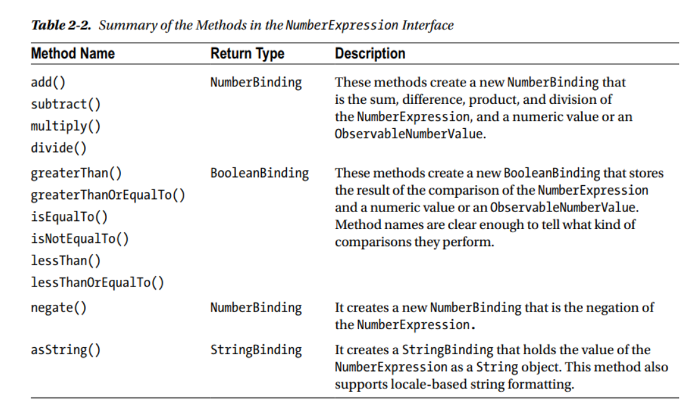

### javaFX

1. bind机制.  

   1. 当依赖变得无效或者改变的时候, 所有的监听会被通知
   2. bind可以是延迟绑定或者是eager binding
      1. eager binding 是在依赖改变之后, 绑定的变量会立即重新计算
      2. 延迟绑定不会立即计算, 会在下次read的时候重新计算
      3. 延迟绑定性能更好
   3. 绑定可以是单向或者双向
      1. 单向: 改变依赖的值, 传播给绑定的变量
      2. 双向绑定: 依赖和绑定的变量彼此同步.  一般的, 双向绑定只会在2个变量间定义
         1. ui组件要和底层数据双向绑定

2. JavaFx中的属性绑定

   1. javaFx中的所有属性都是 observable的

   2. javaFx中, 属性可以代表一个值或者一组值

   3. javaFx中, 属性是对象

   4. IntegerProperty , DoubleProperty,StringProperty都是抽象类. 每一个都有2个具体实现: 1个代表了读写属性, 一个代表了只读属性的包装.

      比如:StringDoubleProperty 和 ReadOnlyDoubleWrapper是2个具体实现

   5. 属性类提供了2个成对的方法get()/set()表示基本类型,   getValue()/setValue()表示对象类型.

   6. 属性类有三部分信息:

      1. 引用 bean,  默认值为null
      2. 名称 name. 不提供, 默认为空字符串
      3. 值  value
      4. 每个属性类提供了 getBean()和getName()的方法. 用于获取 bean和属性名称

3. 使用JavaFx beans

   1. 所有的属性都实现了 ReadOnlyProperty 接口

4. 延迟初始化属性对象

   1. 用来优化内存

   2. 使用场景

      1. 大部分只使用默认值
      2. 不适用绑定的特性

   3. 

   4. Observable接口是顶层接口. 用来观察内容变的无效.   可以注册监听

      1. 处理属性 Invalidation 事件.  在javaFx中使用延迟解析
      2. 当一个invalid属性再次变的invalid, 也不会产生Invalidation 事件
      3. 在重新计算的时候会变得valid. 例如调用了get()或者getValue()方法

   5. ObservableValue 接口继承了 Observable接口. 可以用来观察变化, 当值变化的时候, 会有一个changed event发生.   有一个getValue()的方法返回wrap的值. 可以注册监听器ChangeListener.  监听器 changed()方法接受三个参数(ObservableValue 对象, 旧值, 新值)

      1. InvalidationListener 

         1. ```java
            public void addListener(InvalidationListener listener) {
                helper = ExpressionHelper.addListener(helper, this, listener);
            }
            ```

      2. ChangeListener 

         1. ```java
            public void addListener(ChangeListener<? super Number> listener) {
                helper = ExpressionHelper.addListener(helper, this, listener);
            }
            ```

      3. 都是观察者模式.   监听器成为一个链表

         1.  当有事件发生的时候 , 会调用辅助方法来从头触发事件

         2. ```java
            {@link ExpressionHelper}
            public static <T> void fireValueChangedEvent(ExpressionHelper<T> helper) {
                if (helper != null) {
                    helper.fireValueChangedEvent();
                }
            }
            ```

   6. Property接口 添加了5个bind接口

   7. **避免内存泄漏, 需要调用removeListener** .   对于一些局部添加的的addListener, 可以使用 weak Listener, 一个weak listener是一个WeakListener接口的实例

      1. 
      
   8. 在javaFx中使用绑定

      1. 创建一个绑定:

      2. 

      3. 绑定有一个invalid()方法, 表示是否有效.  当创建之后, 是invalid的. 只有当请求值的时候, 比如 sum.intValue() 调用的时候, 重新计算值, 并且标记为valid.  当你改变值之后, 它又会变成invalid, 知道你下次再请求它的值

      4. **一个绑定, 会对它绑定的所有依赖进行监听, 一旦有个依赖改变, 会设置为invalid. invalid不表示有值改变, 只表示获取值的时候需要重新计算值**

      5. 在javaFx中, 你可以将一个property也绑定到一个bind上. 使用bind方法, 比如

         1. 

         2. 现在 x, y 或者2个变化的时候, z property会变成invalid,  下一次请求z的值的时候, 会重新计算x.add(y) 去得到它的值

         3. 可以调用 unbind()方法解绑. .  例如 z.unbind()

         4. ```java
            IntegerProperty x = new SimpleIntegerProperty(10);
            IntegerProperty y = new SimpleIntegerProperty(20);
            IntegerProperty z = new SimpleIntegerProperty(60);
            
            z.bind(x.add(y));
            System.out.println("after bind , z :Bound = " + z.isBound() + ", z = " + z.get()); //z的值为30
            
            x.set(15);
            y.set(19);
            System.out.println("after change x y, z :Bound = " + z.isBound() + ", z = " + z.get()); //z的值为34
            
            z.unbind();
            
            x.set(100);
            y.set(200);
            System.out.println("after unbinding, z :Bound = " + z.isBound() + ", z = " + z.get()); //!!! z的值为34
            ```

            最后那里是关键, unbind后, 值就不会随x,y变化了

   9. javaFx 支持2种类型的绑定:  有向和双向 

      1. bind()方法在property和ObservableValue之间创建了单向绑定,   bindBidrectional() 在property和其他同类型的property之间创建了双向绑定

      2. 单向绑定有个限制.  例如 z.bind(x.add(y))  , 不能直接改变z的值.  需要先unbind之后, 才能z.set(1111)

      3. 单向绑定还有个限制, 一个property同一时间只能和一组绑定.  比如和x.add(y)   或者 a.add(b)  后来的绑定会替换掉之前的 比如. x=1, y = 2. a=3, b=4, 那么之前的值会是3 . 后来的会是7

      4. 双向绑定也有限制: 他只能在同类型propery之间创建.   但是一个属性可以同一时间绑定多个双向绑定.  双向绑定的属性能够单独的改变, 这个改变影响全部绑定在他上面的属性. 例如

         1.  x = y , x = z 开始的时候, xy=2 , 后来 xz =3 . 那么最后三个值都会和z一样, 是3

         2. ```java
            listing 2-15
            
            IntegerProperty x = new SimpleIntegerProperty(1);
            IntegerProperty y = new SimpleIntegerProperty(2);
            IntegerProperty z = new SimpleIntegerProperty(3);
            
            System.out.println("Before binding:");
            System.out.println("x=" + x.get() + ", y=" + y.get() + ", z=" + z.get());  // 1, 2, 3
            
            x.bindBidirectional(y);  // 实现机制, 2个property 绑定了监听
            System.out.println("After binding-1:");
            System.out.println("x=" + x.get() + ", y=" + y.get() + ", z=" + z.get()); // 2, 2, 3
            
            x.bindBidirectional(z);
            System.out.println("After binding-2:");
            System.out.println("x=" + x.get() + ", y=" + y.get() + ", z=" + z.get()); // 3, 3, 3
            
            System.out.println("After changing z:");
            z.set(19);
            System.out.println("x=" + x.get() + ", y=" + y.get() + ", z=" + z.get()); //19 , 19 , 19
            
            // Remove bindings
            x.unbindBidirectional(y);
            x.unbindBidirectional(z);
            System.out.println("After unbinding and changing them separately:");
            x.set(100);
            y.set(200);
            z.set(300);
            System.out.println("x=" + x.get() + ", y=" + y.get() + ", z=" + z.get());  // 100 , 200, 300
            ```

            **注意, unbind的时候, 每个绑定的都要移除. 比如上面的y和z**

   10. 明白绑定 API

       1. 绑定api分为2类

       2. 高级别绑定api : 让你能够使用javaFx类库来定义 binding. 大部分情况下, 可以使用高级别binding API

          1. 有2部分组成: FLuent APi 和binding class.  可以只使用 Fluent APi 或者 binding class, 或者两者一起来定义绑定

          2. 使用 FLuent api.  叫这个名字是因为可以链式调用. 例如x.add(y).add(z)

          3. 集中在 xxxExpression和 xxxBinding .   xxxExpression有一些让你创建绑定表达式的方法

          4. 
       
          5. binding 接口:
       
             1.  有4个方法
                1. public void dispose()   实现可选, 表示 binding接口不再被使用了. 内部用弱引用来实现
                2. public ObservableList<?> getDependencies()   实现可选.   返回一个代表依赖的不可变的ObservableList  .仅仅是为了debug的使用,这个方法不应该在生产环境使用
                3. public void invalidate()  是binding 作废, 无效
                4. public boolean isValid()   返回是否是有效的

          6. NumberBinding接口: 一个标记接口. 表示实现的实例wrap了一个int, long, float 或者 double类型.  继承了ObservableNumberValue 接口. 所以也会有4个返回方法

          7. ObservableNumberValue   接口:  提供了4个返回方法. 
       
             •	 double doubleValue()
             •	 float floatValue()
      •	 int intValue()
             •	 long longValue()  
       
             ```java
             IntegerProperty x = new SimpleIntegerProperty(100);
             IntegerProperty y = new SimpleIntegerProperty(200);
             // Create a binding: sum = x + y
             NumberBinding sum = x.add(y);
      int value = sum.intValue(); // Get the int value
             ```

          8. ObservableIntegerValue 接口: 提供了get()方法返回指定的int 

          9. NumberExpression  接口:  包括了一些方便的方法用自举的方式去创建binding, 大部分都是复写的
       
             1. 
       
             2.  绑定的返回规则, 和计算符一样, 优先double, float, 最后int
       
                ```java
                   	listing 2-16
                        
                    DoubleProperty radius = new SimpleDoubleProperty(7.0);
                
                    // Create a binding for computing arae of the circle
                    DoubleBinding area = radius.multiply(radius).multiply(Math.PI);
                
                    System.out.println("Radius = " + radius.get() + ", Area = " + area.get());
                
                    // Change the radius
                    radius.set(14.0);
                    System.out.println("Radius = " + radius.get() + ", Area = " + area.get());
                
                    // Create a DoubleProperty and bind it to an expression
                    // that computes the area of the circle
                    DoubleProperty area2 = new SimpleDoubleProperty();
                    area2.bind(radius.multiply(radius).multiply(Math.PI));
                    System.out.println("Radius = " + radius.get() + ", Area2 = " + area2.get());
                }
                ```
       
          10. StringBinding 类: 有着相同的层次结构
       
              1. 
       
              2. 使用concat 连接字符串
       
                 ```java
                 DoubleProperty radius = new SimpleDoubleProperty(7.0);
                 DoubleProperty area = new SimpleDoubleProperty(0);
                 StringProperty initStr = new SimpleStringProperty("Radius = ");
                 
                 // Bind area to an expression that computes the area of the circle
                 area.bind(radius.multiply(radius).multiply(Math.PI));
                 
                 // Create a string expression to describe the circle
                 StringExpression desc = initStr.concat(radius.asString())
                         .concat(", Area = ")
                         .concat(area.asString(Locale.US, "%.2f"));
                 
                 System.out.println(desc.getValue());
                 
                 // Change the radius
                 radius.set(14.0);
                 System.out.println(desc.getValue());
                 ```
       
          11. 三元表达式  new When(condition).then(value1).otherwise(value2)  表示  (condition?value1:value2)的语意
       
              1. condition 必须是ObservableBooleanValue的类型, value1和value2的类型必须相同  Values可以是ObservableValue的实例
       
              2. 一个打印奇偶的例子
       
              3. ```java
                 IntegerProperty num = new SimpleIntegerProperty(10);
                 StringBinding desc = new When(num.divide(2).multiply(2).isEqualTo(num))
                         .then("even")
                         .otherwise("odd");
                 
                 System.out.println(num.get() + " is " + desc.get());
                 
                 num.set(19);
                 System.out.println(num.get() + " is " + desc.get());
                 ```
       
          12. 绑定工具类 api , 方便创建绑定类... 竟然有150多个静态方法
       
              1. 
       
              2. selectXXX() 为了内嵌property创建了一个绑定. 所有的类或者属性都必须是public的. 例如有一个Address的类, 有一个zip属性.  一个person的类,有一个addr属性
       
              3. ```java
                 public class Address
                 {
                     private StringProperty zip = new SimpleStringProperty("36106");
                 
                     public StringProperty zipProperty()
                     {
                         return zip;
                     }
                 }
                 ```
       
                 ```java
                 public class Person
                 {
                     private ObjectProperty<Address> addr = new SimpleObjectProperty(new Address());
                 
                     public ObjectProperty<Address> addrProperty()
                     {
                         return addr;
                     }
                 }
                 ```
       
                 ```java
                 ObjectProperty<Person> p = new SimpleObjectProperty(new Person());
                 
                 // Bind p.addr.zip
                 StringBinding zipBinding = Bindings.selectString(p, "addr", "zip");
                 System.out.println(zipBinding.get());  // 36106
                 
                 // Change the zip
                 p.get().addrProperty().get().setZip("35217");
                 System.out.println(zipBinding.get()); // 35217
                 
                 // Bind p.addr.state, which does not exist
                 StringBinding stateBinding = Bindings.selectString(p, "addr", "state");
                 System.out.println(stateBinding.get()); // null And Exception
                 ```
       
       3. 低级别绑定api : 写自己的逻辑去定义一个binding.  高级别api 不能应对所有的情况. 
       
       4. 使用低级别api包括下面三步:
       
          1. 创建一个绑定类, 它继承了某一个binding类. 例如, 你想创建一个DoubleBinding, 你需要继承 DoubleBinding类
          2. 调用超类的bind()方法去绑定所有的依赖. 
          3. 复写computeValue()方法, 重写你绑定的逻辑. 它返回的类型和绑定类型相同
          4. 另外, 你可以复写其他的binding类中的方法去给你的binding类提供更多的功能. 
       
          5.考虑下计算圆的面积的代码
       
          ​	
       
          ```java
          listing 2-25
          
          public static void main(String[] args)
          {
              final DoubleProperty radius = new SimpleDoubleProperty(7.0);
              final DoubleProperty area = new SimpleDoubleProperty(0);
          
              DoubleBinding areaBinding = new DoubleBinding()
              {
                  {
                      this.bind(radius);
                  }
          
                  @Override
                  protected double computeValue()
                  {
                      double r = radius.get();
                      double area = Math.PI * r * r;
                      return area;
                  }
              };// Bind area to areaBinding
              area.bind(areaBinding);
          
              // Create a StringBinding
              StringBinding desc = new StringBinding()
              {
                  {
                      this.bind(radius, area);
                  }
          
                  @Override
                  protected String computeValue()
                  {
                      Formatter f = new Formatter();
                      f.format(Locale.US, "Radius = %.2f, Area = %.2f",
                              radius.get(), area.get());
                      String desc = f.toString();
                      return desc;
                  }
          
                  @Override
                  public ObservableList<?> getDependencies()
                  {
                      return FXCollections.unmodifiableObservableList(
                              FXCollections.observableArrayList(radius, area));
                  }
          
                  @Override
                  public void dispose()
                  {
                      System.out.println("Description binding is disposed.");
                  }
          
                  @Override
                  protected void onInvalidating()
                  {
                      System.out.println("Description is invalid.");
                  }
              };
          
              System.out.println(desc.getValue());
          
              // Change the radius
              radius.set(14.0);
              System.out.println(desc.getValue());
          }
          ```
       
       5.  利用绑定, 始终将一个圆居中的代码. 
       
          1. ```java
             // Bind the centerX, centerY, and radius to the scene width and height
             c.centerXProperty().bind(scene.widthProperty().divide(2));
             c.centerYProperty().bind(scene.heightProperty().divide(2));
             c.radiusProperty().bind(Bindings.min(scene.widthProperty(),
                     scene.heightProperty())
                     .divide(2));
             ```

