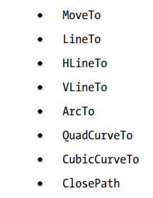

### 2D 形状

##### 使用Path类构建复杂形状

您可以使用Path类绘制复杂的形状。Path类的实例定义形状的路径(大纲)。一个路径由一个或多个子路径组成。子路径由一个或多个路径元素组成。每个子路径都有一个起点和一个终点。

路径元素是PathElement抽象类的实例。以下是PathElement类的子类，用于表示特定类型的路径元素:

在查看示例之前，让我们先概述一下使用Path类创建形状的过程。这个过程类似于用铅笔在纸上画一个形状。首先，你把铅笔放在纸上。你可以重申，“你移动铅笔在纸上的一个点。“无论你想画什么形状，第一步必须是移动铅笔到一个点。现在，你开始移动你的铅笔来画一个路径元素(例如，一条水平线)。当前路径元素的起始点与前一个路径元素的结束点相同。继续绘制所需的路径元素(例如，一条垂直线、一条弧线和一条二次贝塞尔曲线)。最后，您可以在起始点或其他地方结束最后一个路径元素。

定义路径元素的坐标可以是绝对的，也可以是相对的。默认情况下，坐标是绝对的。它是由PathElement类的绝对属性指定的。如果为真(默认值)，坐标就是绝对的。如果它是假的，坐标是相对的。绝对坐标是相对于节点的局部坐标系测量的。将前一个路径元素的结束点作为原点来测量相对坐标。

Path类包含三个构造函数。

no-args构造函数创建一个空形状。其他两个构造函数接受路径元素列表作为参数。路径将路径元素存储在可观察路径中。您可以使用getElements()方法获取列表的引用。您可以修改路径元素列表来修改形状。下面的代码片段显示了使用Path类创建形状的两种方法

路径元素的实例可以作为路径元素同时添加到路径对象中。路径对其所有路径元素使用相同的填充和描边

##### MoveTo Path Element  

MoveTo path元素用于将指定的x和y坐标作为当前点。它的作用是将铅笔举起并放置在纸上指定的点上。路径对象的第一个路径元素必须是MoveTo元素，并且不能使用相对坐标。MoveTo类定义了两个双属性，它们是点的x和y坐标。

MoveTo类包含两个构造函数。无args构造函数将当前点设置为(0.0,0.0)。另一个构造函数接受当前点的x和y坐标作为参数

