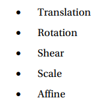
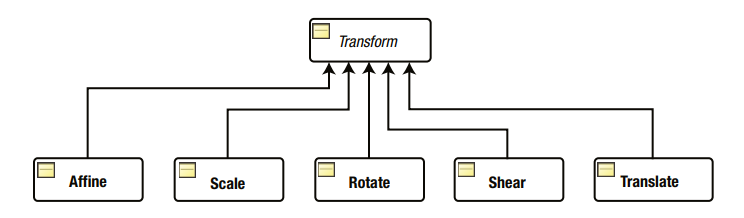
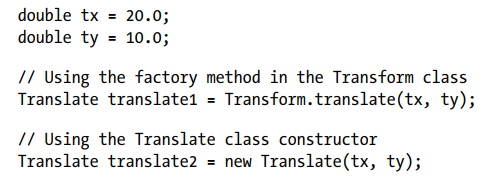
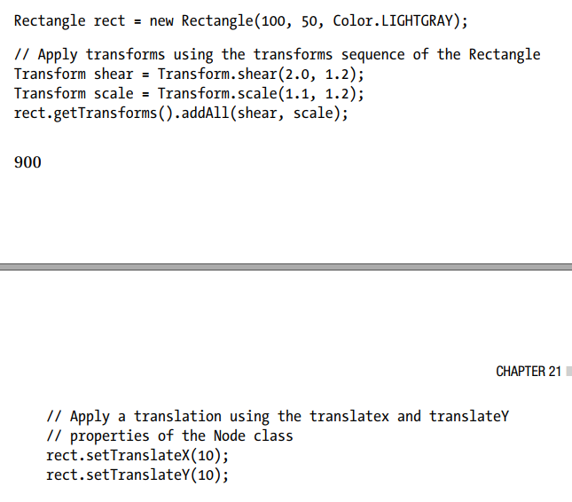
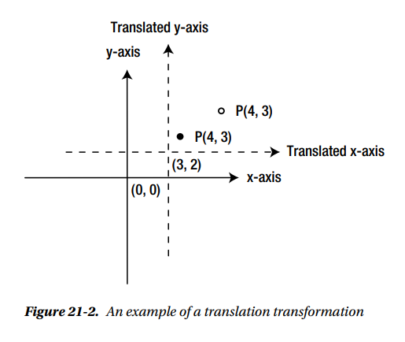
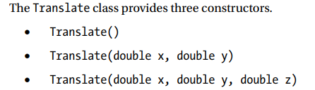

##### Understanding Transformations

什么是变换?

1. 变换是坐标空间中的点到它们自身的映射，保持它们之间的距离和方向。可以对坐标空间中的点应用几种类型的转换。JavaFX支持以下类型的转换:

   

   • 转化

   • 旋转

   • 剪切

   • 放大缩小

   • 仿射

抽象转换类的实例表示JavaFX中的转换。Transform类包含节点上的所有类型转换使用的通用方法和属性。它包含工厂方法来创建特定类型的转换。图21-1显示了代表不同类型转换的类的类图。类的名称与类提供的转换类型匹配。所有类都在javafx.scene.transform   包中。

仿射变换是保留点、直线和平面的广义变换。平行线在变换后保持平行。它可能不能保持线之间的角度或点之间的距离。但是，直线上点与点之间的距离比率是保留的。平移、缩放、同质变换、相似变换、反射、旋转、剪切等都是仿射变换的例子。

仿射类的一个实例表示一个仿射变换。这个类对初学者来说不容易使用。它的使用需要先进的数学知识，如矩阵。如果需要特定类型的转换，请使用特定的子类，如Translate、Shear等，而不是使用广义仿射类。您还可以组合多个单独的转换来创建一个更复杂的转换，我们在本书中将不讨论这个类。

使用转换很容易。然而，有时它令人困惑，因为有多种方法来创建和应用它们。创建转换实例有两种方法:

•使用Transform类的工厂方法之一——例如，用translate()方法创建一个translate对象，用rotate()方法创建一个rotate对象，等等。

•使用特定的类来创建特定类型的转换——例如，Translate  类用于转换，Rotate  类用于旋转，等等。

下面这两个Translate  对象表示相同的translation  :

有两种方法可以将translation  应用到节点:

•使用Node类中的特定属性。例如，使用节点类的translateX、translateY和translateZ属性将转换应用到节点。注意，您不能以这种方式应用shear transformation  (剪切变换)。

•使用节点的转换序列。节点类的getTransforms()方法返回一个ObservableList&lt;Transform&gt;用所有转换对象填充此列表。转换将按顺序应用。你只能用这种方法应用剪切变换。

应用转换的两种方法的工作原理略有不同。我们将在讨论转换的具体类型时讨论这些区别。有时，可以同时使用上述两种方法来应用转换，在这种情况下，在对节点的属性进行转换之前应用转换序列中的转换。

下面的代码片段对矩形应用了三种转换:剪切、缩放和转换:

利用变换序列进行剪切和缩放。转换使用Node类的translateX和translateY属性应用。变换序列中的变换，剪切和缩放，依次应用，然后是平移。

#### Translation Transformation  

平移将节点的每个点相对于父坐标系统在指定的方向上移动固定距离。它是通过将节点的局部坐标系原点移动到新的位置来实现的。计算点的新位置很简单——只需在3D空间中的每个点的坐标上添加一个三个一的数字。在二维空间中，在每个点的坐标上加上一对数字。

假设您想通过(tx, ty, tz)将平移应用到三维坐标空间。如果一个点在平移前有坐标(x, y, z)，平移后它的坐标是(x + tx, y + ty, z + tz)。

图21-2显示了转换转换的一个示例。变换前的坐标轴用实线表示。转换后的轴以虚线表示。注意点P的坐标在转换后的坐标空间中保持不变(4,3)。但经过变换后，该点相对于原始坐标空间的坐标发生了变化。原始坐标空间中的点以纯黑色填充色显示，在转换后的坐标空间中，不以填充色显示。坐标系(0,0)的原点移动到(3,2)，点P(移动点)在原始坐标空间的坐标变为(7,5)，计算为(4+ 3,3 +2)。

Translate类的实例表示转换。它包含三个属性。

•	 x
•	 y
•	 z  

属性指定转换后节点本地坐标系的新原点的x、y和z坐标。属性的默认值是0.0。

no-args构造函数使用x、y和z属性的默认值创建一个Translate对象，这些属性本质上不代表任何转换。另外两个构造函数允许您指定沿这三个轴的平移距离。对组的转换应用于组中的所有节点。

比较节点类的layoutX和layoutY属性与translateX和translateY属性的使用。layoutX和layoutY属性在不转换局部坐标系统的情况下在局部坐标系统中定位节点，而translateX和translateY属性通过移动原点来转换节点的局部坐标系统。通常，layoutX和layoutY用于在场景中放置节点，而translation用于在动画中移动节点。如果您为一个节点设置了这两个属性，那么它的本地坐标系统将使用转换进行转换，然后，该节点将使用其layoutX和layoutY属性放置到新的坐标系统中。

清单21-1中的程序创建了三个矩形。默认情况下，它们被放置在(0,0)。它对第二个和第三个矩形应用一个转换。图21-3显示了转换后的矩形。