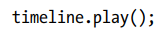

#### 了解动画

在本章中，你会学到:

•JavaFX中的动画是什么

关于JavaFX中用于执行动画的类

•如何执行时间轴动画，以及如何在时间轴上设置提示点

动画

•如何控制动画，如播放，反转，暂停和停止

•如何使用过渡执行动画

•关于不同类型的插值器和他们在动画中的角色

### What Is Animation?  

在现实世界中，动画意味着通过快速连续地显示图像而产生的某种运动。例如，当你看电影时，你正在观看图像，这些图像变化得如此之快，以至于你产生了一种运动的错觉。

在JavaFX中，动画被定义为随着时间改变一个节点的属性。如果改变的属性决定了节点的位置，那么JavaFX中的动画将产生一种在电影中发现的运动错觉。不是所有的动画都需要有动作;例如，随着时间的推移改变形状的填充属性是JavaFX中不涉及运动的动画。

为了理解动画是如何执行的，理解一些关键概念是很重要的。

•	 Timeline(时间轴)
•	 Key frame(关键帧)
•	 Key value(键值)
•	 Interpolator  (插入器)

动画是在一段时间内完成的。Timeline 表示动画在给定时刻与相关关键帧之间的时间进展。Key frame表示在时间轴上的特定时刻动画节点的状态。Key value具有关联的键值。键值表示节点的属性值以及要使用的Interpolator  。

假设你想在10秒内将一个圆从左向右水平移动。图22-1显示了在某些位置的圆… 粗的水平线表示时间线。带实心轮廓的圆圈表示时间轴上特定瞬间的关键帧。与关键帧相关联的关键值显示在顶部一行。例如，第5秒关键帧的圆圈的translateX属性值为500，如图tx=500所示。

开发人员提供时间线、关键帧和关键值。在这个例子中，有五个关键帧。如果JavaFX只在5个相应的瞬间显示5个关键帧，那么动画看起来会很不稳定。为了提供一个平滑的动画，JavaFX需要在时间轴上的任何瞬间插入圆的位置。也就是说，JavaFX需要在两个连续提供的关键帧之间创建中间关键帧。JavaFX在一个插值器的帮助下做到了这一点。默认情况下，它使用一个线性插值器，它会随着时间线性地改变动画属性。也就是说，如果时间轴上的时间超过了x%，则该属性的值在初始目标值和最终目标值之间为x%。带有虚线轮廓的圆圈是由JavaFX使用插值器创建的。

### Understating Animation Classes  

抽象的Animation类表示一个动画。它包含所有类型动画使用的通用属性和方法。

JavaFX支持两种动画类型。

•Timeline animations   时间轴动画

•Transitions   转换

在时间轴动画中，创建时间轴并向其添加关键帧。JavaFX使用插值器创建中间关键帧。Timeline类的实例表示一个Timeline动画。这种类型的动画需要更多的代码，但是它提供了更多的控制。

通常会执行几种类型的动画(沿着路径移动一个节点，随着时间改变一个节点的不透明度，等等)。这些类型的动画称为过渡。它们是使用内部时间线执行的。转换类的实例表示一个转换动画。转换类的几个子类支持特定类型的转换。例如，FadeTransition类通过随时间改变节点的不透明度来实现衰落效果动画。您可以创建转换类的实例(通常是它的一个子类的实例)，指定动画属性的初始值和最终值以及动画的持续时间。JavaFX负责创建时间轴和执行动画。这种类型的动画更容易使用。

有时，您可能希望连续或同时执行多个转换。SequentialTransition和ParallelTransition类让您分别顺序地和同时地执行一组转换。

### Understanding Utility Classes  

在讨论JavaFX动画的细节之前，我将讨论一些用于实现动画的实用程序类。下面几节将讨论这些类。

Understanding the Duration Class  

Duration类在javafx.util包。它以毫秒、秒、分钟和小时为单位表示一段时间。它是一个不可变类。持续时间表示动画的每个周期所需的时间。持续时间可以表示正的或负的持续时间

创建Duration对象有三种方法

•使用构造函数

•使用工厂方法

•使用字符串格式的持续时间中的valueOf()方法

构造函数花费的时间以毫秒为单位。  Duration tenMillis = new Duration(10);  

工厂方法为不同的时间单位创建Duration对象。它们是millis()、seconds()、minutes()和hours()。

Duration tenMillis = Duration.millis(10);
Duration tenSeconds = Duration.seconds(10);
Duration tenMinutes = Duration.minutes(10);
Duration tenHours = Duration.hours(10) ;

valueOf()静态方法接受一个包含持续时间的字符串参数，并返回一个持续时间对象。参数的格式为“number[ms|s|m|h]”，其中number为时间量，ms、s、m、h分别表示毫秒、秒、分钟、小时。

Duration tenMillis = Duration.valueOf("10.0ms");
Duration tenMililsNeg = Duration.valueOf("-10.0ms");  

还可以分别使用duration类的unknown和不定常数表示未知时间长度和不定时间长度。可以使用isIndefinite()和isUnknown()方法检查持续时间是否表示不确定的或未知的时间。这个类还声明了两个常数，1和0，分别表示持续时间为1毫秒和0(没有时间)

Duration类提供了几种操作持续时间的方法(将一个持续时间添加到另一个持续时间中，将一个持续时间除以一个数字，比较两个持续时间，等等)。清单22-1显示了如何使用Duration类。

##### Understating the KeyValue Class  

KeyValue类的实例表示一个键值，该键值在动画期间根据特定的间隔进行插值。它封装了三件事:

•一个目标

•目标的最终值

•一个插入器

目标是一个WritableValue，它限定所有JavaFX属性为目标。结束值是目标在间隔结束时的值。利用插值器计算中间关键帧。

关键帧包含一个或多个关键值，它定义了时间轴上的一个特定点。图22-3显示了时间轴上的间隔。该间隔由两个瞬间定义:瞬间t1和瞬间t2。两个瞬时都有一个相关的关键帧;每个关键帧都包含一个关键值。动画可以在时间轴上向前或向后进行。当interval开始时，从interval的结束关键帧的键值中获取目标的结束值，并利用interval的插值器计算中间关键帧。在图中，假设动画正向进行，并且instant1发生在instant2之前。从instant1到instant2，使用key-value2的插值器计算区间的关键帧。如果动画是反向进行的，则使用key-value1的插值器来计算从instant2到instant1的中间关键帧。

KeyValue类是不可变的。它提供了两个构造函数。

插入器。LINEAR被用作默认的插值器，它随时间线性地插值动画属性。稍后我将讨论不同类型的插值器。

下面的代码片段创建了一个Text对象和两个KeyValue对象。translateX属性是目标。0和100是目标的结束值。使用默认的插值器。

下面的代码片段与上面显示的代码片段相似。它使用了插值器。EASE_BOTH插值器，减慢动画的开始和结束。

##### Understanding the KeyFrame Class  

关键帧定义时间轴上指定点的节点的目标状态。目标状态由与关键帧关联的关键值定义。

关键帧包含四件事。

•时间线上的一个瞬间

•一组键值

•一个名字

•一个ActionEvent处理程序

与关键帧相关联的时间轴上的瞬间由 Duration  定义，持续时间是关键帧在时间轴上的偏移量。

•关键值集定义了关键帧目标的最终值。

关键帧可以有一个可选的名称，它可以用作提示点，在动画期间跳转到它定义的瞬间。Animation类的getCuePoints()方法返回时间轴上线索点的映射。

还可以选择将ActionEvent处理程序附加到关键帧。在动画期间，当关键帧的时间到达时，ActionEvent处理程序被调用。

KeyFrame类的实例表示一个关键帧。这个类提供了几个构造函数:

下面的代码片段创建了两个关键帧实例，指定文本节点在0秒和3秒的时间轴上的translateX属性:

##### Understating the Timeline Animation  

时间轴动画用于动画节点的任何属性。Timeline类的实例表示一个Timeline动画。使用时间轴动画包括以下步骤:

•构建关键帧

•创建一个带有关键帧的时间轴对象

•设置动画属性

•使用play()方法运行动画

您可以在创建时间轴时或之后向时间轴添加关键帧。时间轴实例将所有关键帧保存在一个可观察的关键帧中。对象。getKeyFrames()方法返回列表。您可以在任何时候修改关键帧的列表。如果时间轴动画已经在运行，您需要停止并重新启动它，以获取修改后的关键帧列表。

Timeline类包含几个构造函数

无参数构造函数创建一个时间轴，没有关键帧，动画以最佳速度运行。其他构造函数允许您指定动画的目标帧速率(每秒帧数)和关键帧。

请注意，关键帧添加到时间轴的顺序并不重要。时间轴将根据他们的时间偏移对他们进行排序。

清单22-2中的程序启动一个时间轴动画，该动画在场景中从右到左水平滚动文本，直到永远。图22-4显示了该动画的屏幕截图。

执行动画的逻辑在start()方法中。该方法首先创建一个文本对象，一个带有文本对象的窗格，并为舞台设置一个场景。在展示舞台之后，它设置了一个动画。

它获得场景和文本对象的宽度。

创建了两个关键帧:一个用于时间= 0秒，另一个用于时间= 3秒。动画使用文本对象的translateX属性来改变其水平位置，使其滚动。在0秒时，文本被定位在场景宽度，因此它是不可见的。在3秒时，它被放置在场景的左边，距离等于它的长度，所以再次它是不可见的。

时间轴对象是由两个关键帧创建的。

默认情况下，动画将只运行一次。也就是说，文本将从右向左滚动一次，动画将停止。您可以为动画设置循环计数，即动画需要运行的次数。你可以通过将循环计数设置为Timeline.INDEFINITE来永久运行动画。

最后，通过调用play()方法开始动画.

我们的例子有一个缺陷。当场景的宽度发生变化时，滚动文本不会更新其初始水平位置。当场景宽度发生变化时，你可以更新初始关键帧来纠正这个问题。将以下语句追加到清单22-2的start()方法。它为场景宽度添加了一个ChangeListener，用于更新关键帧并重新启动动画。

有可能创建一个时间轴动画只有一个关键帧。关键帧作为最后一个关键帧。时间轴使用正在动画的WritableValue的当前值合成初始关键帧(时间= 0秒)。为了查看效果，让我们替换这个语句

时间轴将使用文本对象的translateX属性的当前值0.0创建一个初始关键帧。这一次，文本滚动方式有所不同。滚动首先将文本放置在0.0，然后将其滚动到左侧，这样它就超出了场景。

##### Controlling an Animation  

Animation类包含可用于以各种方式控制动画的属性和方法。下面的部分将解释这些属性和方法以及如何使用它们来控制动画。

Playing an Animation  

Animation类包含四个方法来播放动画。

play()方法从当前位置播放动画。如果动画从未开始或停止，它将从开始播放。如果动画暂停了，它将从它暂停的位置开始播放。在调用play()方法之前，可以使用jumpTo(持续时间)和jumpTo(字符串cuePoint)方法将动画的当前位置设置为特定的持续时间或提示点。调用play()方法是异步的。动画可能不会立即开始。在动画运行时调用play()方法没有任何效果。

playFrom()方法从指定的持续时间或指定的提示点播放动画。调用这个方法相当于使用jumpTo()方法设置当前位置，然后调用play()方法。

方法的作用是:从头开始播放动画(持续时间= 0)

##### 延迟动画的开始

可以使用delay属性指定启动动画的延迟时间。该值在Duration中指定。默认情况下，它是0毫秒。

##### Stopping an Animation  

使用stop()方法停止正在运行的动画。如果动画没有运行，则此方法不起作用。当方法异步执行时调用该方法时，动画可能不会立即停止。该方法将当前位置重置为开始位置。也就是说，在stop()之后调用play()将从一开始播放动画。

##### Pausing an Animation  

使用pause()方法暂停动画。在动画未运行时调用此方法是无效的。此方法异步执行。在动画暂停时调用play()方法从当前位置播放它。如果您想从一开始就播放动画，请调用playFromStart()方法。

##### 了解动画的状态

动画可以是以下三种状态之一:

•	 Running
•	 Paused
•	 Stopped  

这三种状态由动画的RUNNING, STOPPED, and PAUSED   常量表示。状态枚举。你不能直接改变动画的状态。通过调用Animation类的一个方法来改变它。该类包含一个只读状态属性，可用于在任何时候了解动画的状态。

##### Looping an Animation  

动画可以循环多次，甚至是无限次。cycleCount属性指定动画中的循环数，默认为1。如果想在无限循环中运行动画，请指定animation。不定表示循环数。必须将cycleCount设置为大于零的值。如果在动画运行时cycleCount发生了更改，则必须停止动画并重新启动以获取新值。

##### 自动反转动画

