## Jvm:

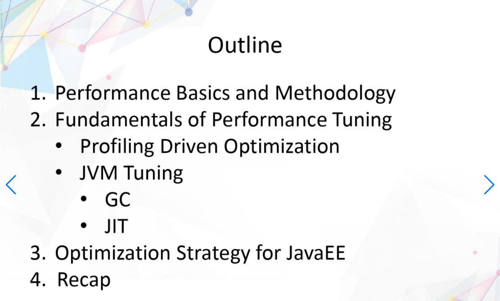

##### 概要:

1. 性能基础和方法
2. 性能调优的基础
   1. 分析驱动优化
   2. jvm调优
      1. gc
      2. jit
   3. javaEE的优化策略
   4. 回顾

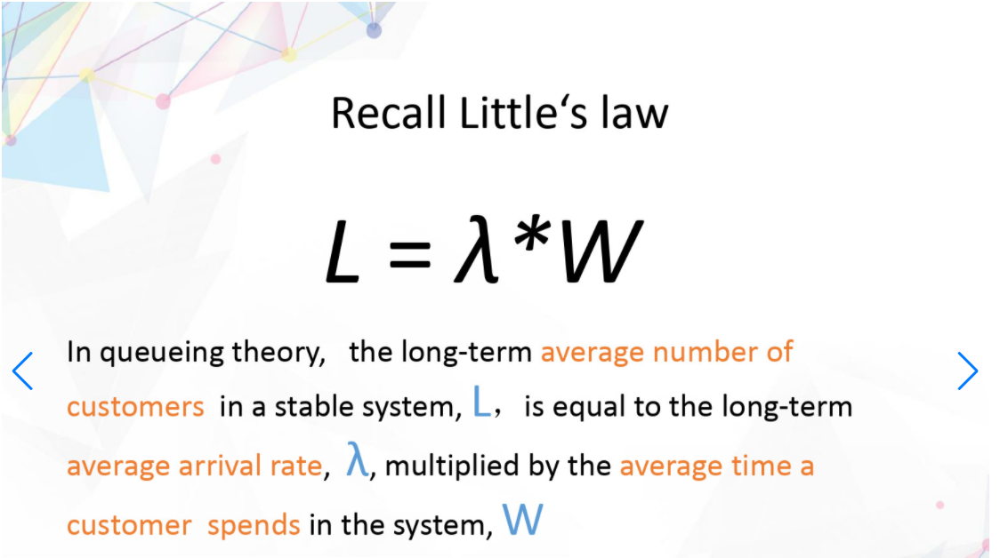

回忆little 法则

L = λ * W

在队列理论中, 稳定系统中长时间的 消费者平均数量:L. 等于 长时间的平均arrival lv, λ,  乘以 系统中消费者平均花费的时间, W

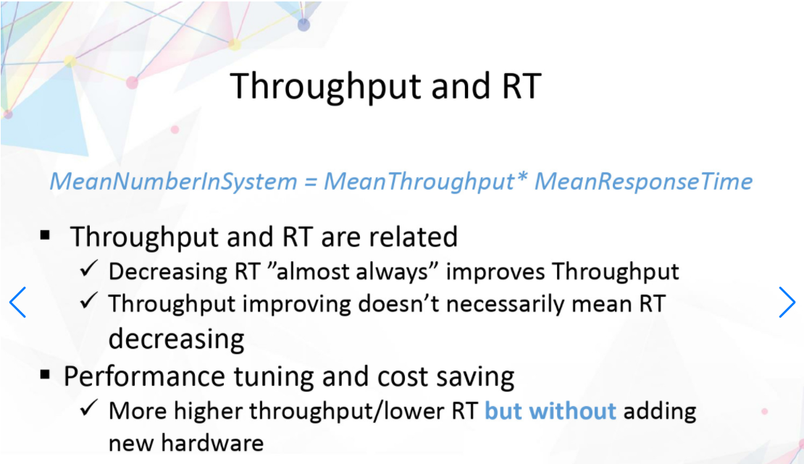

吞吐量和RT

1. 吞吐量和RT是有关联的
   1. 减少RT 通常总是能提升吞吐量
   2. 吞吐量的提高并不一定意味着RT的减少
2. 性能调优和成本节约
   1. 更高的吞吐/更低的RT, 但是不增加新的硬件 

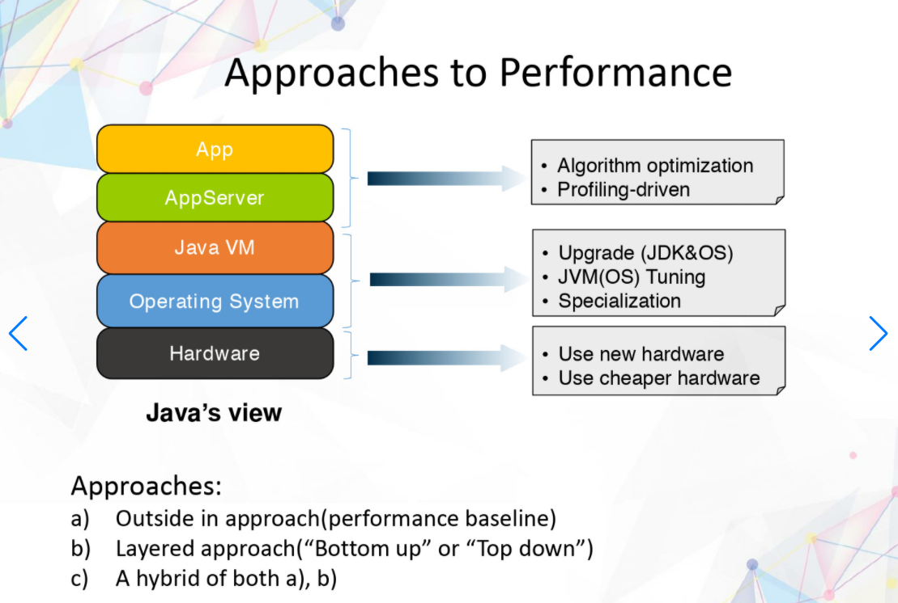

性能的方法

App AppServer

1. 算法优化
2. 分析驱动

Java VM  os

	1. 升级 jdk&os
 	2. jvm调优
 	3. 定制

硬件

	1. 使用新硬件
 	2. 使用更便宜的硬件

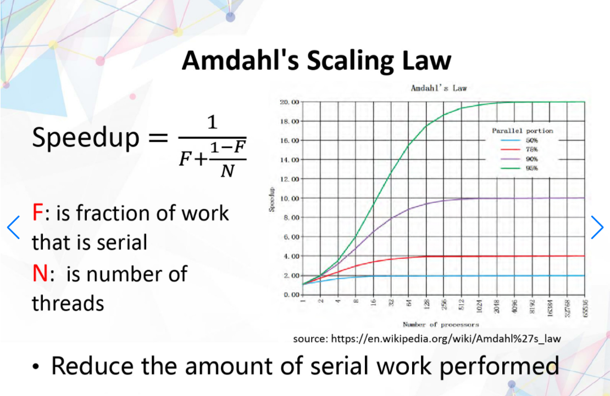

## 阿姆达尔定律(Amdahl’s Law)

阿姆达尔定律的模型阐释了我们现实生产中串行资源争用时候的现象。如下图模型，一个系统中，不可避免有一些资源必须串行访问，这限制了我们的加速比，即使我们增加了并发数（横轴），但取得效果并不理想

F : 串行工作部分所占比例，取值0～1，

N: 并行线程数、并行处理节点个数

如果我们假定算法没有改进之前，执行总时间是1（假定为1个单元）。那么改进后的算法，其时间应该是串行工作部分的耗时（F）加上并行部分的耗时(1-F)/n，由于并行部分可以在多个cpu核上执行，所以并行部分实际的执行时间是(1-F)/n

##### 减少序列化工作的执行数量

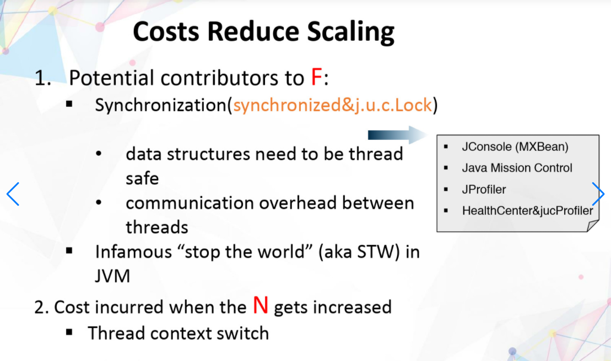

##### 成本减少比例

1. F的潜在贡献者:(串行)
   1. Synchronization(lock 和 synchronized)
      1. 数据结构需要是线程安全的
      2. 线程间的通信开销
   2. JVM 中的 stop the world

2. N增加时产生的成本
   1. 线程上下文切换

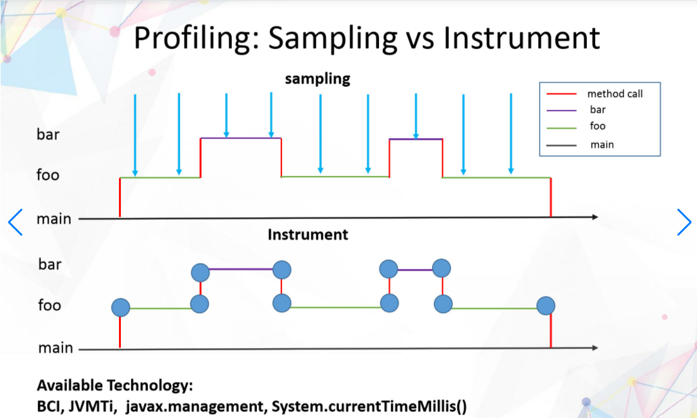

​	

分析 : 采样 vs instrument(工具?)

有效技术:

BCI, 

JVMTI

​	JVMTI(JVM Tool Interface) 位于jpda 最底层， 是Java 虚拟机所提供的native编程接口。 JVMTI可以提供性能分析、debug、内存管理、线程分析等功能。

javax.management 

​	 javax.management 的描述 提供 Java Management Extensions 的核心类。 Java Management Extensions (JMXTM) API 是一个用于管理和监视的标准 API。典型用途包括： 查询并更改应用程序配置 累积有关应用程序行为的统计并使其可用 通知状态更改及错误状况。 JMX API 还可以作为解决方案的一部分来管理系统、网络等。 API 包括[远程访问](https://baike.baidu.com/item/远程访问/3326708)，因此，远程管理程序可以基于这些目的与正在运行的应用程序交互。

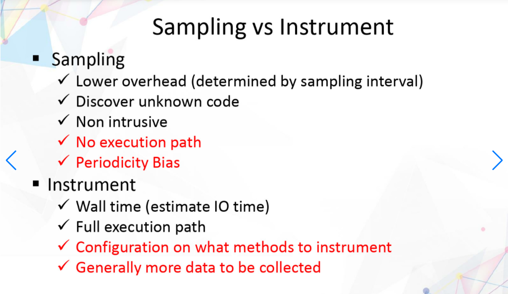

采样:

1. 低开销(由采样频率决定)
2. 发现未知的代码???
3. 非侵入的
4. 没有执行路径
5. 周期性的偏斜 ???

工具

1. 墙时间(估计IO时间)
2. 完整执行路径
3. 可以配置在哪些方法上面进行 instrument
4. 通常需要收集更多的数据

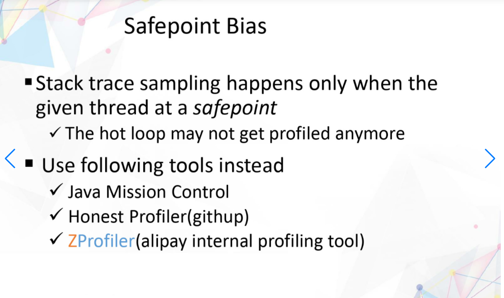

##### 安全点偏斜

堆栈采样只会发生在指定线程在安全点的时候

​	1.  热点循环可能不会被分析

使用下面的工具代替

 1. java Mission Control(简称JMC)

     	1. JDk7 7u40之后自带。主要有两种功能
         - 实时监控JVM运行时的状态
         - Java Flight Recorder 取样分析
    	2. https://www.jianshu.com/p/2da3623ce17b

 2. Honest Profiler

     1. ##### **授权协议:** Apache

    	2. **开发语言:** Java C/C++

    	3. **操作系统:** Linux

    	4. **软件首页:** https://github.com/RichardWarburton/honest-profiler

    	5. honest-profiler 是一个 JVM 分析器软件。包含两个主要组件，一个小的 C++ jvmti 代理用来写日志文件；Java 应用用来渲染和显示 Log 分析数据。

 3. ZProfiler(阿里内部分析工具)

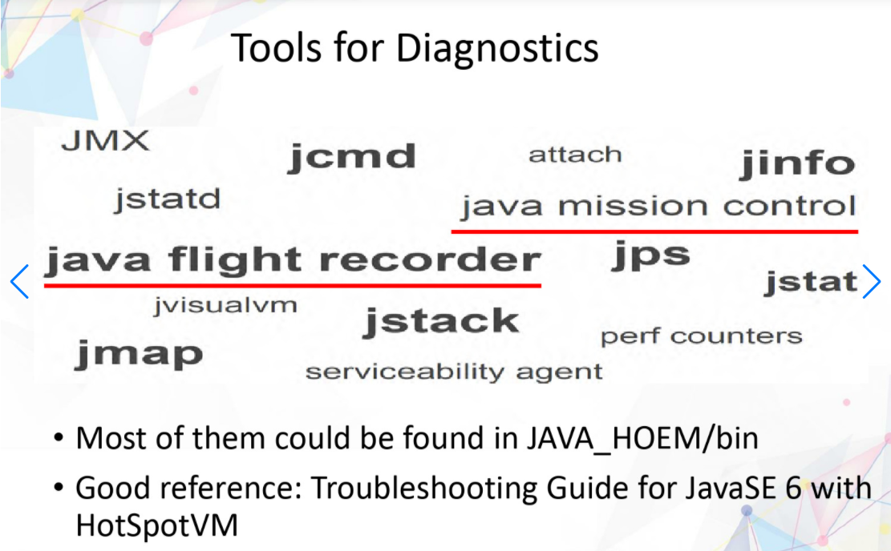

##### 诊断工具

大部分都能在JAVA_HOME/bin里面找到

有很好的参考:  javaSE 6的hotspotVM故障排除指南(应该是个文档)

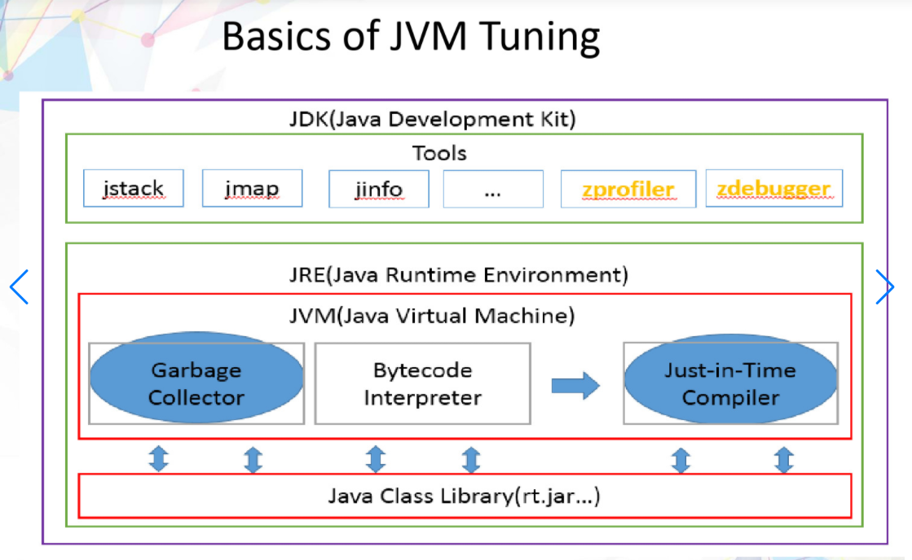

jvm基础调优

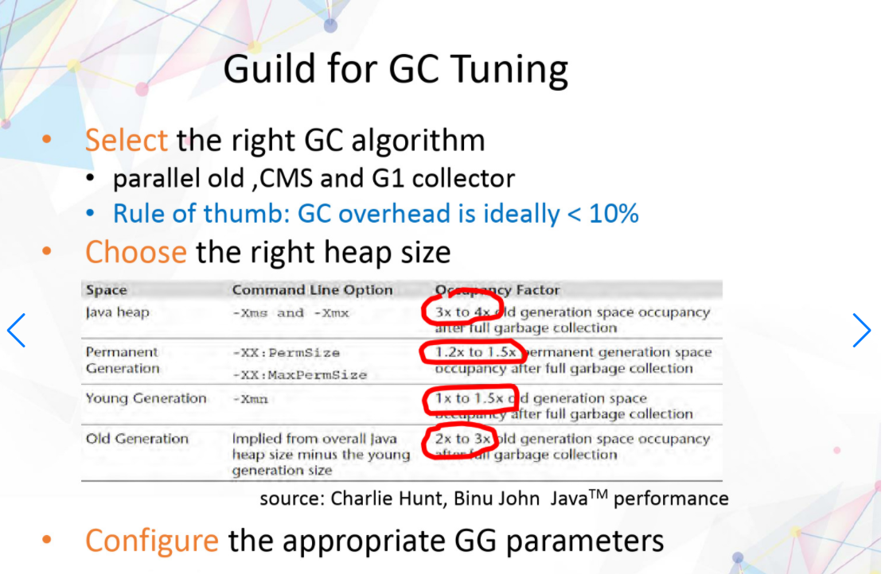GC

GC 调优指导

1. 选择正确的gc算法
2. 经验法则:   gc的理想开销 < 10%

选择正确的Heap大小

配置合适的GC参数

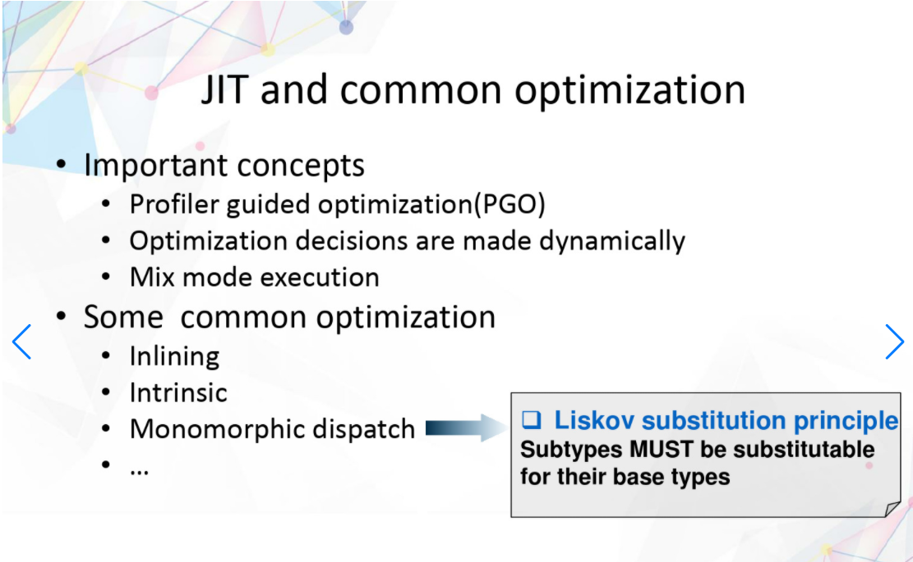

jit 和通用优化

重要概念

1. 分析指导优化(PGO)
2. 优化决策是动态做出的
3. 混合模式执行

一些通用优化

1. 内联
2. Intrinsic ??
3. 单型的调度  (理氏替换原则       子类型必须能够替换它们的基类型)

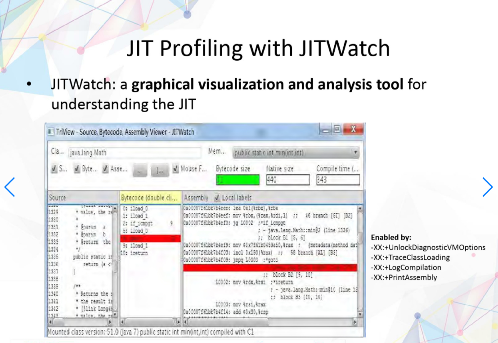

使用JITWatch 分析JIT

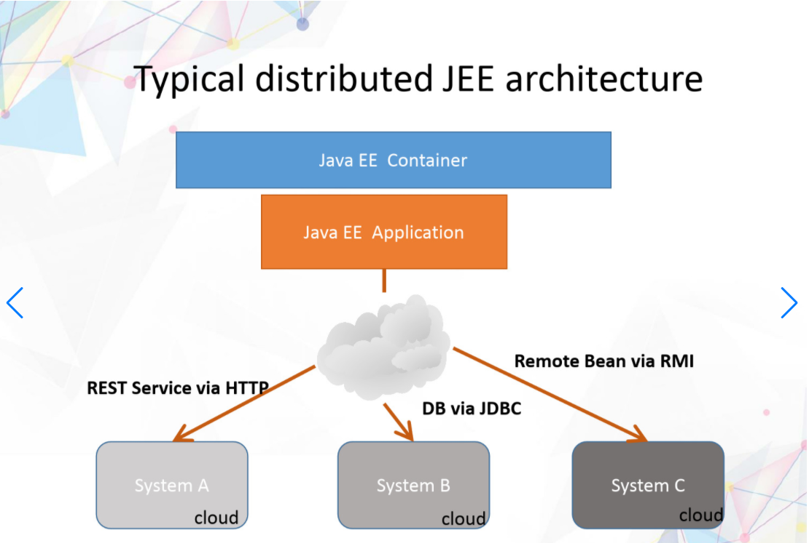

典型分布式 架构

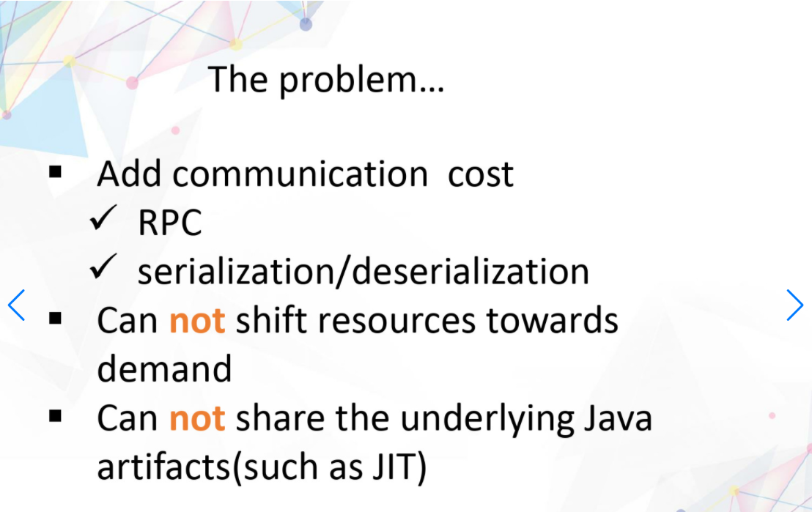

问题 :

1. 交互消耗
   1. RPC (远程方法调用)
   2. 序列化/ 反序列化
2. 不能将资源转向需求
3. 不能共享底层java 工件(比如jit)

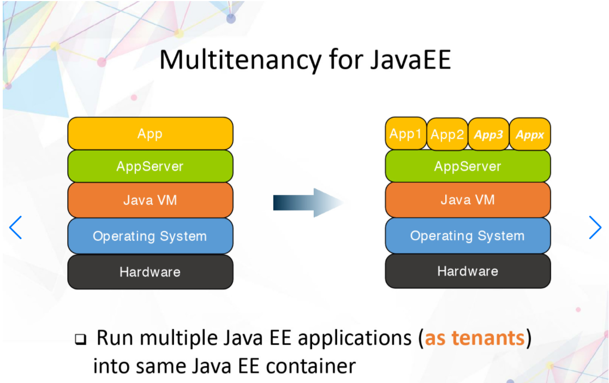

运行多个javaEE 应用程序(比如 tenants) 在同一个java EE 容器里面

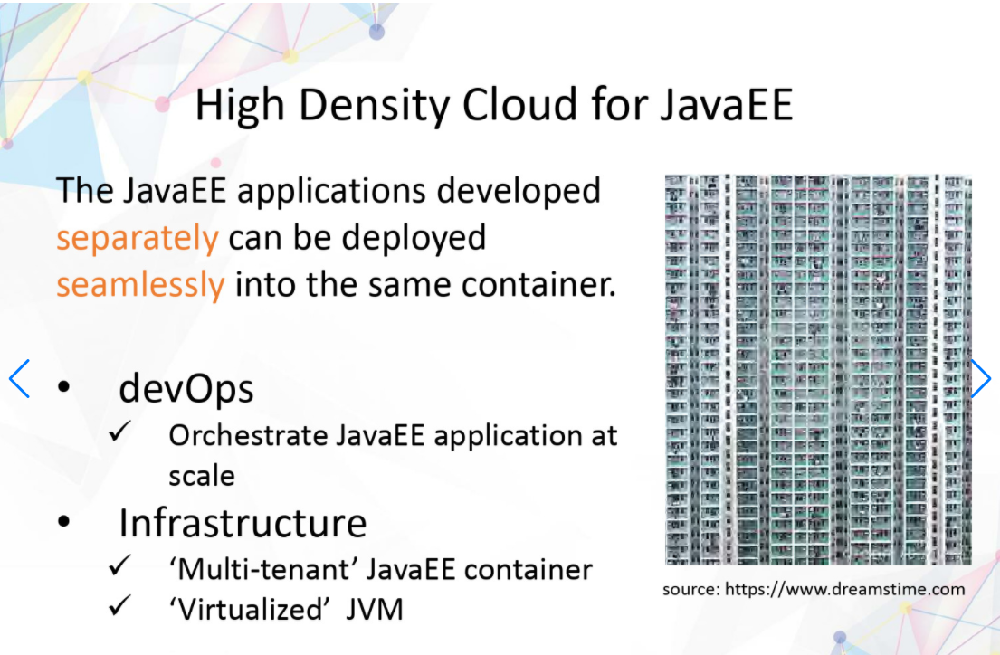

javaEE的高密度云

**单独**开发的javaEE应用程序可以**无缝**地部署到同一个容器中

​	大规模协调javaEE应用程序

基础设施

1. ###### 多租户（Multi-tenant） javaEE 容器  

   1. 在这个“云”山雾罩的时代，“多租户”是一个重要的概念，无论是公有云还是私有云，多租户的支持是必须的。那么什么是多租户呢？
   2. 多租户是指软件架构支持一个实例服务多个用户（Customer），每一个用户被称之为租户（tenant），软件给予租户可以对系统进行部分定制的能力，如用户界面颜色或业务规则，但是他们不能定制修改软件的代码。

2. 虚拟化的 JVM

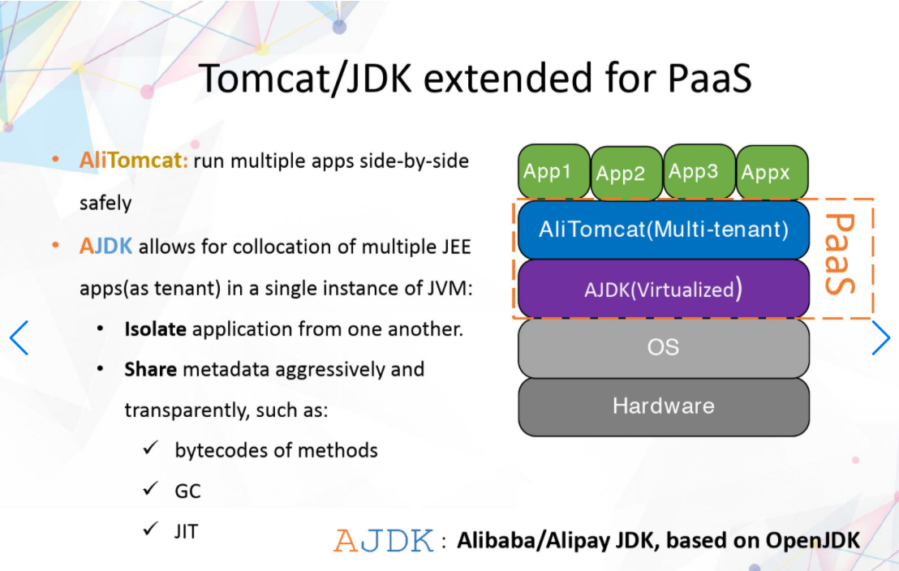

Paas  的 tomcat/JDK 扩展 

​	通过网络进行程序提供的服务称之为[SaaS](https://baike.baidu.com/item/SaaS)(Software as a Service)，而[云计算](https://baike.baidu.com/item/云计算)时代相应的服务器平台或者开发环境作为服务进行提供就成为了 PaaS(Platform as a Service)。

aliTomcat:  安全运行多个应用程序

aJDK  允许多个javaEE应用程序在一个JVM实例中进行配置

1. 隔离  应用和其他应用隔离

2. 共享  入侵并且透明的metadata, 比如

   1. 方法字节码
   2. GC
   3. JIT

   

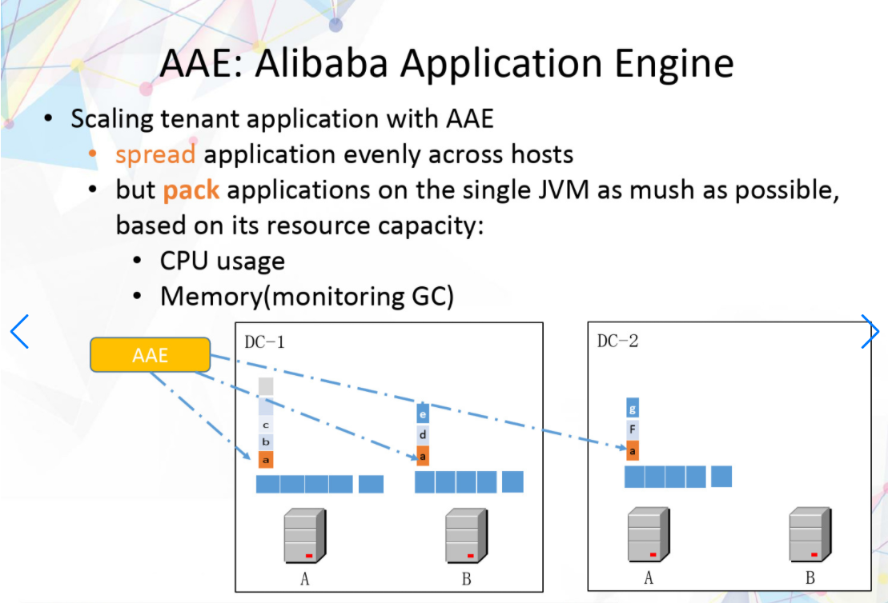

AAE: 阿里 应用程序引擎

使用AAE扩展租户应用程序

1. 在主机之间均匀地分布应用程序
2. 但是，根据单个JVM的资源容量，尽可能地将应用程序打包在单个JVM上
   1. cpu 使用
   2. 内存( 监视 GC)

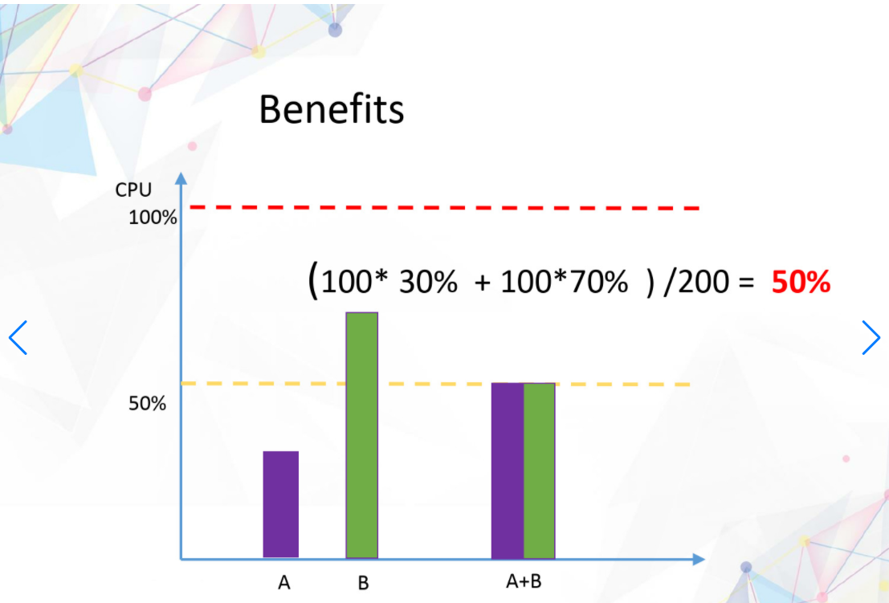

好处应该是尽可能的复用硬件

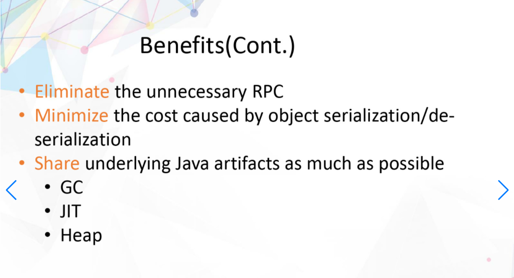

收益:

1. 消除不必要的RPC
2. 最小化对象序列化/反序列化造成的成本
3. 尽可能多地共享底层java工件
   1. GC
   2. JIT
   3. 堆

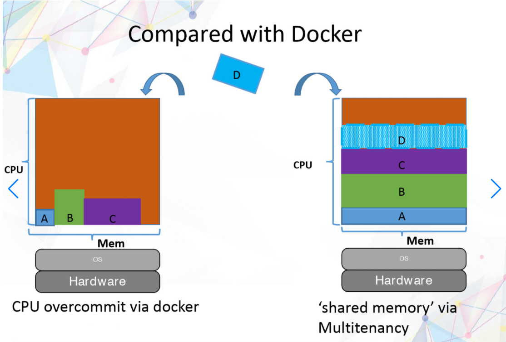

和 docker 的比较

docker **里面 cpu 会过量使用**  

AAE  **多租户 共享内存**

