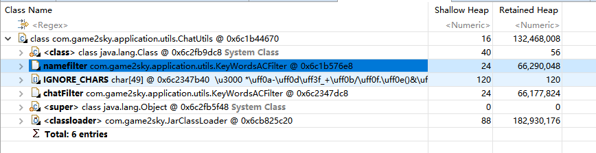

#### G1 调优

​	问题: youngGc 发生的时候, 内存不下降. 导致java heap oom

1. 内存溢出的话, 可以加参数  
   1. -XX:+HeapDumpOnOutOfMemoryError -XX:HeapDumpPath=dump.hprof 来dump内存查看
2. 开启远程jvisualvm端口 
   1. -Dcom.sun.management.jmxremote.port=6677 -Dcom.sun.management.jmxremote.ssl=false - Dcom.sun.management.jmxremote.authenticate=false
3. -verbose  -XX:+TraceClassLoading -XX:+TraceClassLoading  查看类加载 卸载的信息

1. **java -XX:PrintFlagsInitial | grep manageable 打印哪些可以动态修改**
2. jinfo -flag +HeapDumpBeforeFullGC 进程id
3. jinfo -flag +HeapDumpAfterFullGC 进程id 
4. -XX:+HeapDumpOnOutOfMemoryError：OOM时自动dump内存快照
   -XX:HeapDumpPath=dump.hprof：快照文件存储位置

