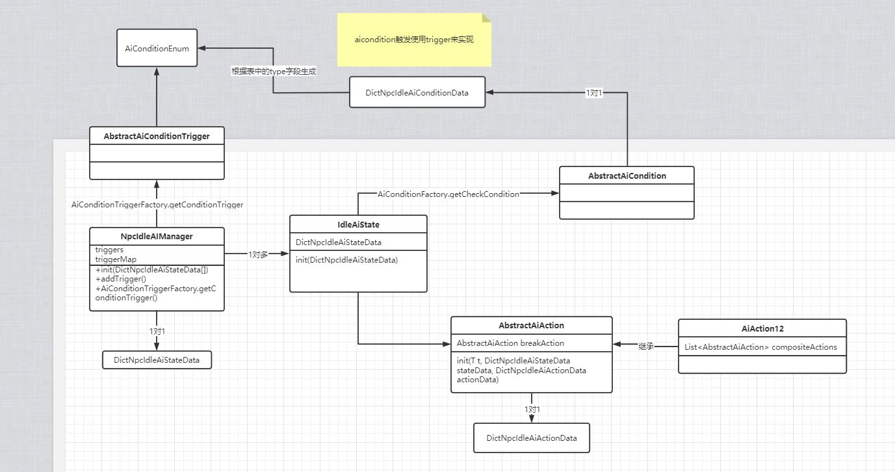
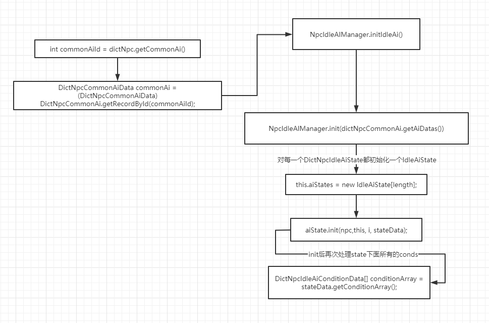

### NpcAiModule

通用AI管理器

// 类图



```java
class NpcIdleAIManager
{
    private Npc npc;

    /**
     * 表格数据
     * 后面的优先级更高
     */
    private IdleAiState[] aiStates;

    /**
     * 条件标志是否更新
     */
    private boolean isDirty;

    /**
     * 各个状态的条件状态
     */
    private boolean[][] conditions;

    /**
     * key事件类型，value 关联的条件索引 (状态索引，条件索引) 一组
     */
    private EnumMap<AIEventEnum,TIntArrayList> eventToCondition = new EnumMap<>(AIEventEnum.class);

    /**
     * 当前运行的状态索引
     */
    private int curStateIndex;

    /**
     * 条件触发器
     */
    private List<AbstractAiConditionTrigger> triggers = new ArrayList<>();

    /**
     * 条件触发器
     * key: 触发器类型, value:条件触发器
     */
    private EnumMap<AiConditionTriggerEnum, List<AbstractAiConditionTrigger>> triggerMap = new EnumMap(AiConditionTriggerEnum.class);

    // 添加触发器
    void addTrigger(int stateIndex, int conditionIndex, DictNpcIdleAiConditionData data){}

    void tick(int interval);

    // 检查所有条件
    void checkAiCondition();
}
```


```java
NpcIdleAIManager.class
    
/**
 * tick检查
 */
public void tick(int interval)
{
    //触发器
    if(!triggers.isEmpty())
    {
        for (int i = 0, size = triggers.size(); i < size; i++)
        {
            triggers.get(i).tick(interval);
        }
    }
    //ai条件检查 [Mine 条件检查, 主要方法]
    checkAiCondition();
 
    IdleAiState aiState = getIdleAIState(this.curStateIndex);
    if(aiState != null)
    {
        aiState.executeAiAction(interval);
    }
}
```

```java
NpcIdleAIManager.class

/**
 * 检查各个状态条件是否满足
 * 是否需要切换状态
 */
private void checkAiCondition()
{
    if(!isDirty)
    {
        return;
    }

    boolean result = false;
    int index = 0;
    int curStateIndex = this.curStateIndex;
    
    // [Mine 从0到当前state索引遍历  找到一个condition[]都为true的索引]
    first:
    for (int i = 0, size = curStateIndex; i <= size; i++)
    {
        boolean[] condition = conditions[i];
        for (int j = 0, length = condition.length; j < length; j++)
        {
            if(!condition[j])
            {
                continue first;
            }
        }
        // 找到一个都为true的状态索引了, 跳出循环
        result = true;
        index = i;
        break;
    }
    if(result)
    {
        if(index < curStateIndex)
        {
            //执行下一状态
            executeNextState(index);
        }
    }
    else if(curStateIndex != (aiStates.length-1))
    {
        //所有条件都未不满足，切换到第一个行为
        resetState();
    }
    isDirty = false;
}
```

状态切换 逻辑

```java
IdleAiState.class

/**
 * 状态切换
 * @param index
 */
public void executeNextState(int index)
{
    IdleAiState aiState = getIdleAIState(curStateIndex);
    if(aiState != null)
    {
        //打断当前状态 [Mine 执行breakAction]
        aiState.breakAiState();
    }
    //设置，并执行下一状态
    curStateIndex = index;
    aiState = getIdleAIState(curStateIndex);
    if(aiState != null)
    {
        aiState.setBreakCurState(false);
        // [Mine 开始执行action]
        aiState.executeNextAction();
    }
}
```


```java
IdleAiState.class

/**
 * 行为正常执行完，执行下一个行为
 * 如果没有下一行为，切换到第一个状态
 */
public void executeNextAction()
{
    if(isBreakCurState)
    {
        //状态已经被打断，不再执行
        return;
    }
    this.curActionIndex++;
    int index = this.curActionIndex;
    //已经执行到最后一个行为
    if(index >= actions.length)
    {
        // [Mine 重置索引!!]
        reset();
        //重置状态索引,跳转到优先级最低一个
        this.idleAIManager.resetState();
        resetConditionMark(stateIndex);
        return;
    }

    //判断状态切换，是否还执行此行为
    AbstractAiAction aiAction = getAiAction(index);
    if(aiAction != null)
    {
        checkChangeAction(aiAction.getActionId());
        aiAction.executeAiAction(this,0);
    }
}
```


```java
AbstractAiAction.class

/**
 * 行为执行,会进行下一行为判断
 */
public final void executeAiAction(IdleAiState idleAIState, int interval)
{
    if(isComplete)
    {
        return;
    }
    toExecuteAiAction(idleAIState, interval);

    //行为已经完成，直接返回
    if (isComplete)
    {
        //不是持续行为
        if(!actionData.getIsContinue())
        {
            //重置参数
            reset();
            //执行下一行为
            idleAIState.executeNextAction();
        }
        return;
    }
}
```





```java
abstract class AbstractAiConditionTrigger
{
    protected NpcIdleAIManager idleAIManager;
    /**
     * 状态索引
     */
    protected int stateIndex;
    /**
     * 条件索引
     */
    protected int conditionIndex;
    /**
     * 参数
     */
    protected DictNpcIdleAiConditionData conditionData;

    void init(NpcIdleAIManager idleAIManager, int stateIndex, int conditionIndex, DictNpcIdleAiConditionData data);   
}
```


一个实例代表npc的一种状态, 对应一个**DictNpcIdleAiState**记录

```java
class IdleAiState<T extends AbstractCharacter>
{
    private T owner;

    /**
     * 所属状态索引
     */
    private int stateIndex;

    /**
     * 空闲ai
     */
    private NpcIdleAIManager idleAIManager;

    /**
     * 状态数据
     */
    private DictNpcIdleAiStateData stateData;

    /**
     * 进入条件
     */
    private AbstractAiCondition[] conditions;

    /**
     * 执行行为
     */
    private AbstractAiAction[] actions;

    /**
     * 状态切换，执行行为 (已经执行过， 不再执行)
     */
    private AbstractAiAction[] changeActions;

    /**
     * 状态切换时,退出执行的行为id （一定执行）
     */
    private AbstractAiAction[] exitActions;

    /**
     * 当前运行行为索引
     */
    private int curActionIndex = -1;

    /**
     * 当前状态是否被打断
     */
    private boolean isBreakCurState;

    //高优先级状态达成，打断当前状态
    //1、执行打断行为
    //2、执行切换状态行为
    //3、执行退出状态行为
    void breakAiState();
}

```


```java
abstract class AbstractAiAction<T extends AbstractCharacter>
{
    protected T owner;

    /**
     * 行为配置数据
     */
    protected DictNpcIdleAiActionData actionData;

    /**
     * 是否执行
     * 默认执行，若执行过，则不在执行
     */
    protected boolean isRun;

    /**
     * 当前行为是否完成
     */
    protected boolean isComplete;

    /**
     * 打断行为
     */
    protected AbstractAiAction breakAction;    
}
```

