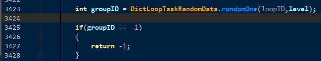

### 任务

1. 接取环任务随机流程

   1.  从DictLoopTaskBaseData 判断条件
   2.  成功后 得到一个LoopTaskData 数据结构  (如果是接取的时候, 需要这个数据结构为空, 或者没有接取过, 否则会报错)
   3. 

   

   ​	生成 LoopTaskData数据结构

   

   

   ​	

   

   

   1.  开始根据环数随机任务
      1. 
      2. 根据 loopId, level 从LoopTaskRankdom表中 获取一个GroupId
      3. 从LoopTaskGroup表中查询出数据
      4. 从taskIds字段中随机一个任务 taskId
      5. 调用 acceptTask的逻辑, 进行接取任务
   2.  进行任务的时候,  客户端发送CSTaskStep.  