### 任务

##### 接取环任务随机流程

1.  从DictLoopTaskBaseData 判断条件
2.  成功后 得到一个LoopTaskData 数据结构  (如果是接取的时候, 需要这个数据没有接取过, 否则会报错)
3. 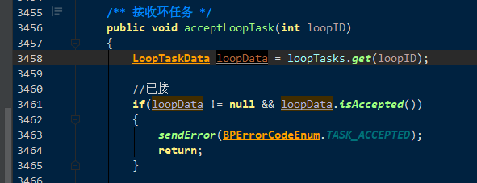

生成 LoopTaskData数据结构

 getLoopData() 方法

​	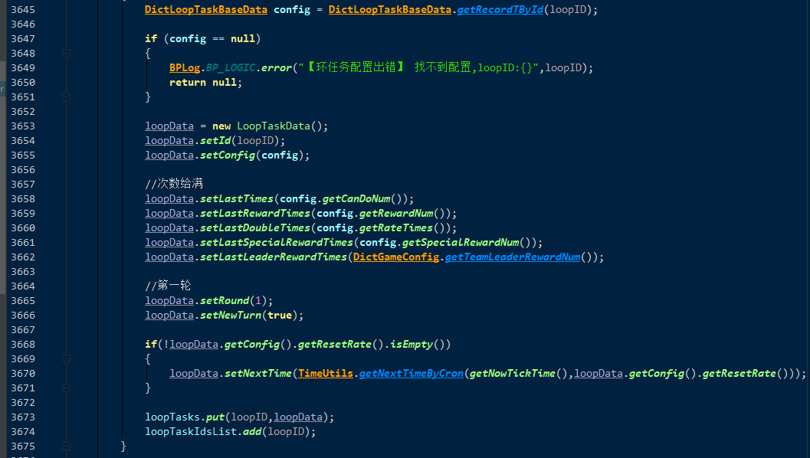

1.  开始根据环数随机任务
   1. 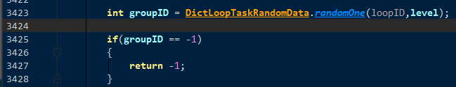
   2. 根据 loopId, level 从LoopTaskRankdom表中 获取一个GroupId
   3. 从LoopTaskGroup表中查询出数据
   4. 从taskIds字段中随机一个任务 taskId
   5. 调用 acceptTask的逻辑, 进行接取任务.
   
2. Task -> TaskStep -> TaskTarget

   接取任务的时候初始化任务数据.  里面有一个taskStep数据. 有当前taskStep对应的taskTarget数据

   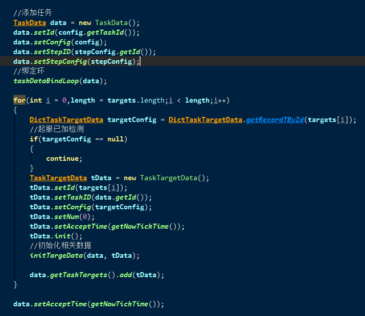

   如果任务有环的话. 按照环任务的配置, 走一套同步任务机制

   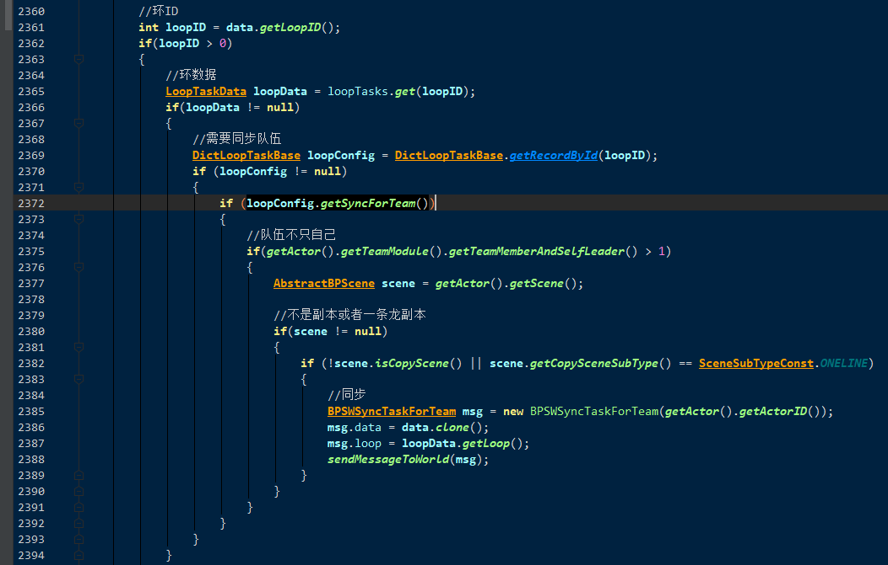

   

​	接下来真正执行接取任务逻辑

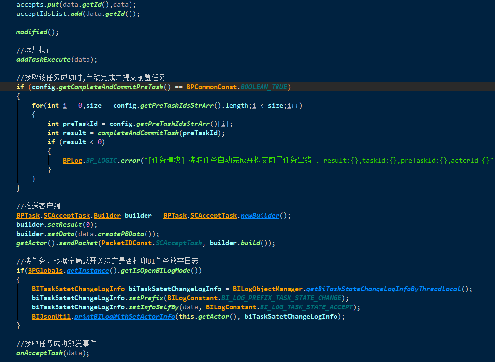

​	  [1. 首先将TaskData放入集合 accepts]  

​	  [2. 进入 addTaskExecute(data);]

​      [3. 发送接收成功消息给客户端]

​	  [4. 成功接收消息后的回调]

​		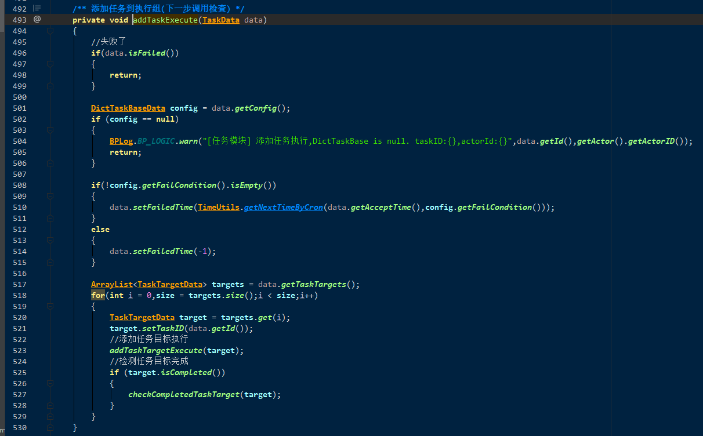

设置失败条件.  开始循环检查目标是否完成

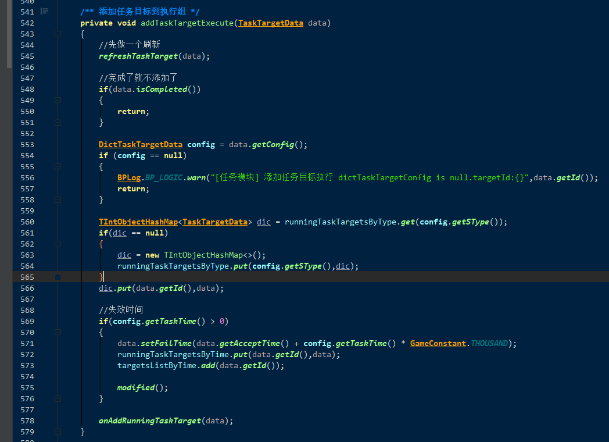

	      1.	[在refreshTaskTarget里面,  根据 DictTaskTargetConfig的 stype字段类型, 来各自检查TaskTarget是否完成 ]
   	      2.	检查 completed字段
   	      3.	根据 stype 注册到 runningTaskTargetsByType 容器中
   	      4.	 处理失效时间逻辑
   	      5.	onAddRunningTaskTarget()回调

 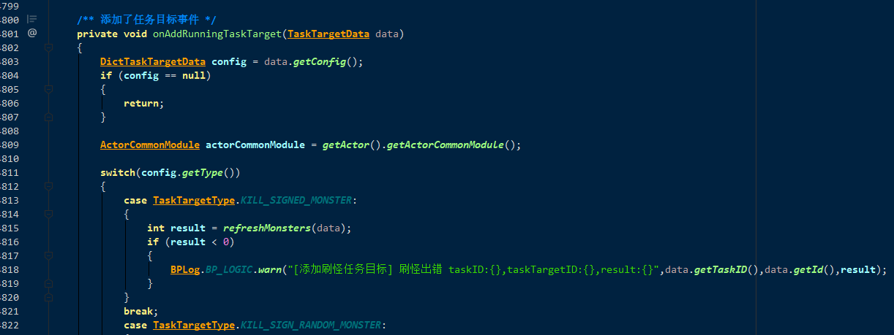

这里 是根据 TaskTargetConfig的 type字段来进行switch分发的

每一个TaskTarget完成后, 需要检查隶属的Task的TaskTarget是否全部完成.

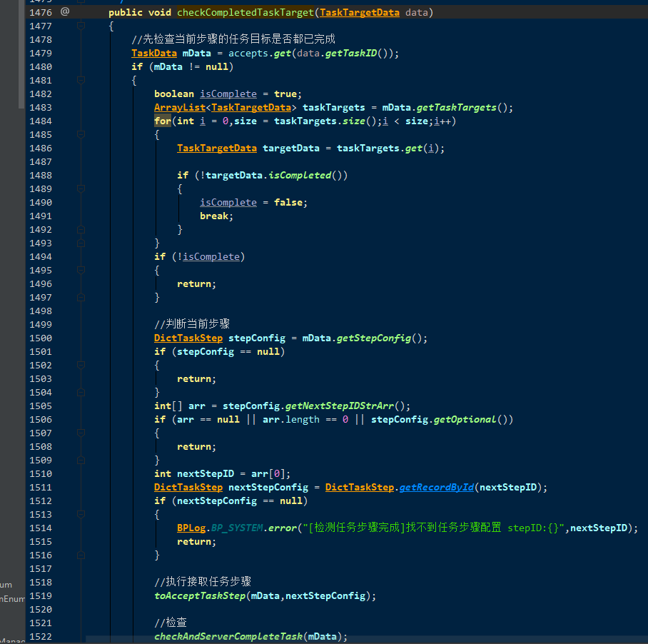

检查TaskTarget的taskId 是否全部完成

如果完成, 接取下一步的taskStep中的TaskTarget.. **!!! 这里面又会调用之前的接受逻辑. 有可能会执行好几轮下去(但是只要是树结构 , 就不会递归), 可能会直接执行完Task**

所以下一步就是检查Task是否完成

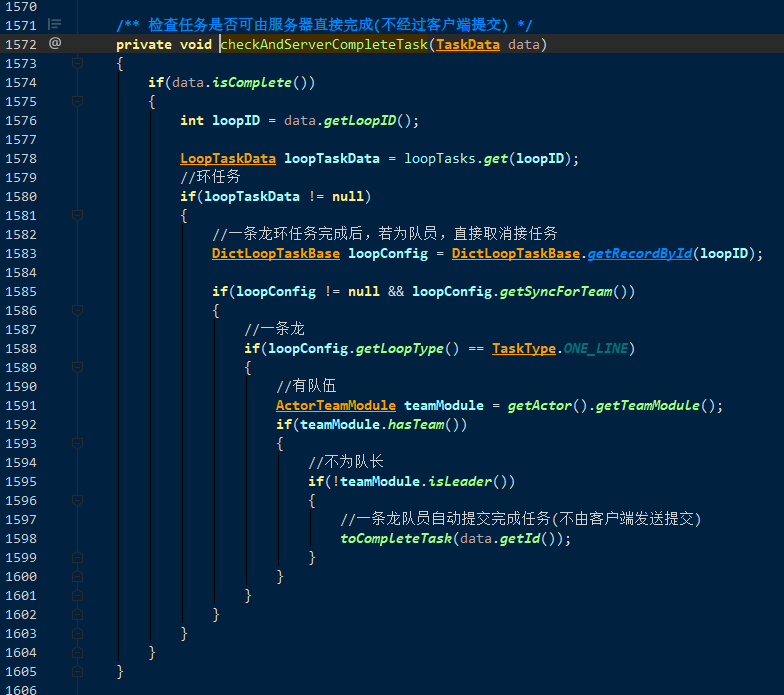

​	这里注意下TaskData的isComplete()检查判断

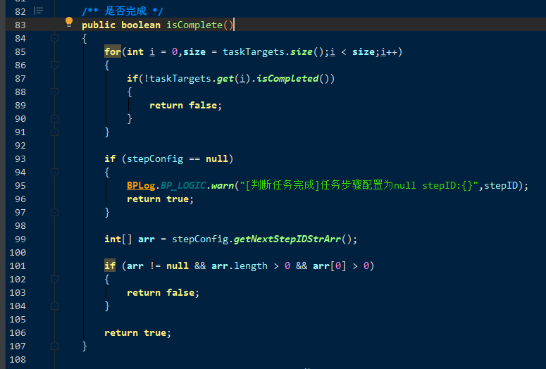

有一个TaskTarget没complete, 返回false

都完成了, 没有下一个的TaskStep, 则返回true

如果有下一个TaskStep, 表里填了数据的话, 则返回false

其他返回true

1.  进行任务的时候,  客户端发送   CSTaskStep 请求. 
2.  ​     