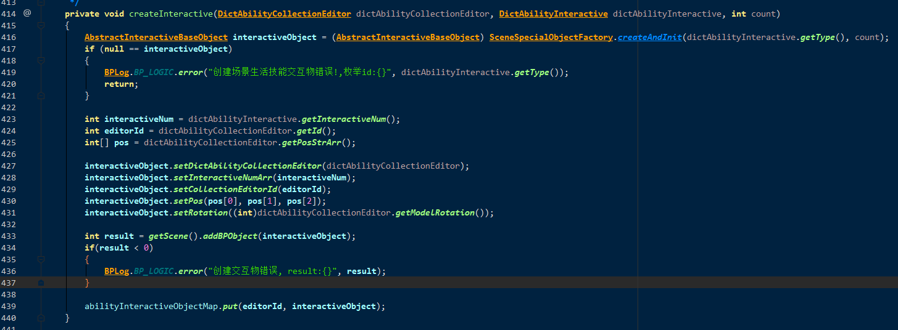

### 保卫分舵

创建交互物



 需要组队, 

1. 需要组队.  触碰后,  客户端发送 CSAbilityInteractive请求到服务器.  方法内部的AbstractInteractiveLogic交互物逻辑类为GuildDefendInteractiveLogic.
2. 有几率直接获得奖励.
3. 每个队伍一个交互物只能触碰一次 


由活动开始 刷新npc

```java
WorldGuildDefendModule.onActivityStart()
```