### 光复唐氏

1.  在自己帮派的npc处接取. (需要判断 接取任务的时候 是否在自己帮派中)
2. 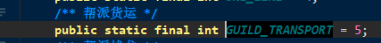

3. 接取成功后

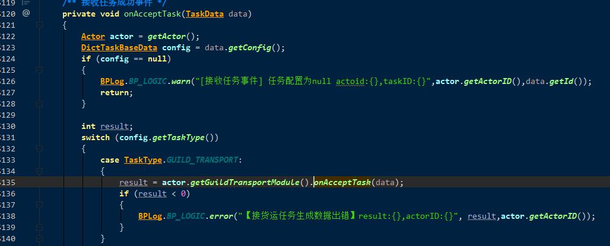

​	4. 根据配置的数量随机任务,  根据任务类型设置 任务状态(杀怪任务设置为 **未接取**, 读条后开始倒计时,   其他设置成已经接取)

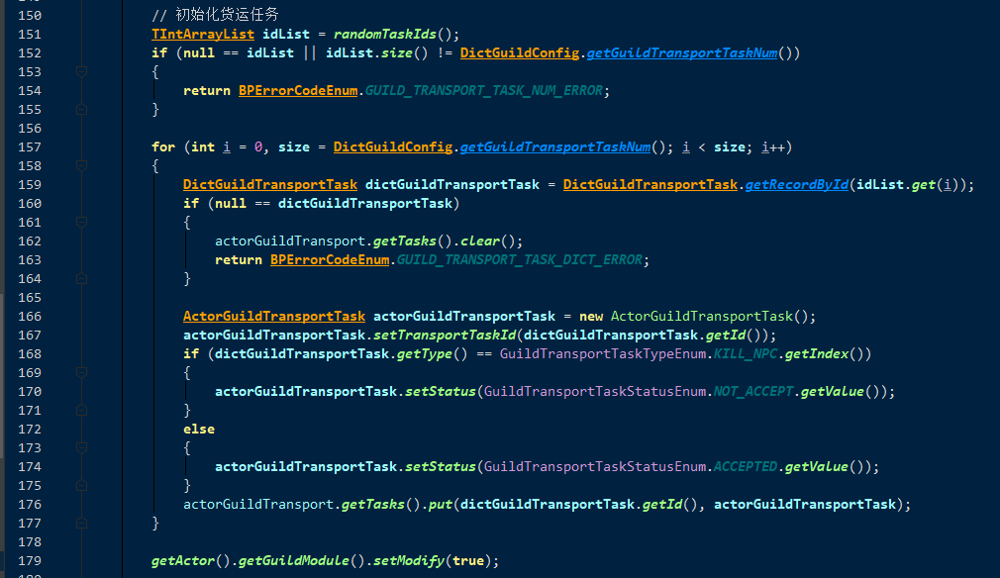

5. 发送界面数据.  分为助人的界面, 还是自己的界面

   自己的界面

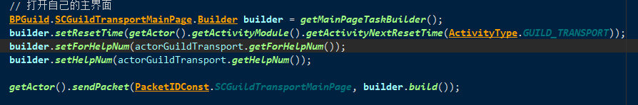

​	求助的界面

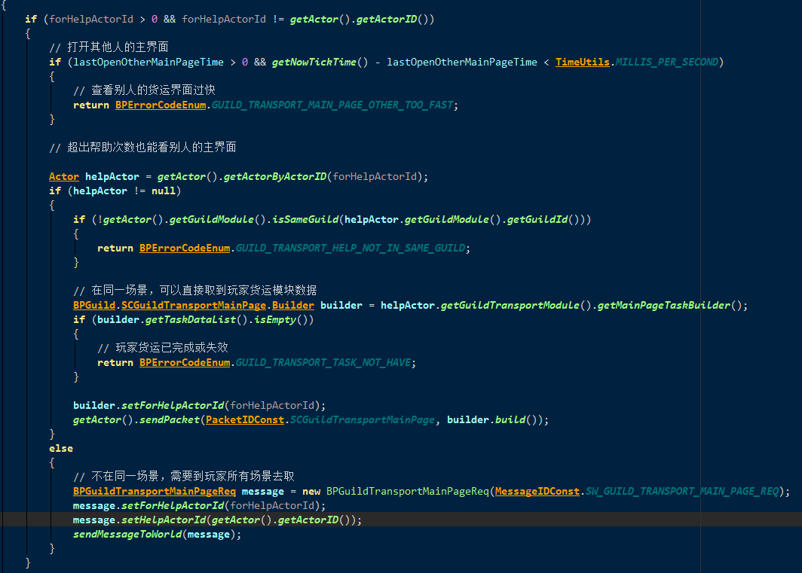

6. **次数刷新是走 活动的重置**

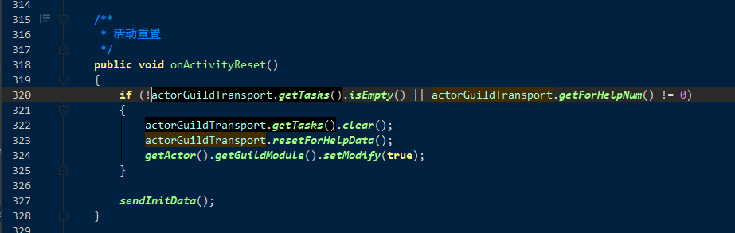

7. 杀怪任务, 开始的时候是未接取, 当点击埋伏的时候, 任务开始.  倒计时也开始.  此时客户端发送的是开始读条请求, 可以查看GuildTransportTask.xlsx中的配置

   ​	代码快速查看(CommonStripeTypeEnum类的枚举)

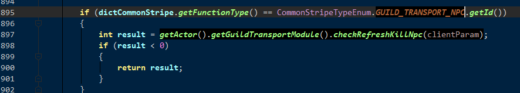

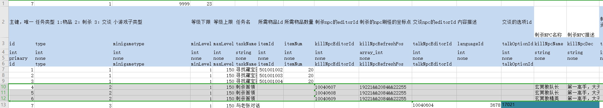

8. 刷新出的怪物npc 为  **GuildTransportNpc.class** 查看里面的方法

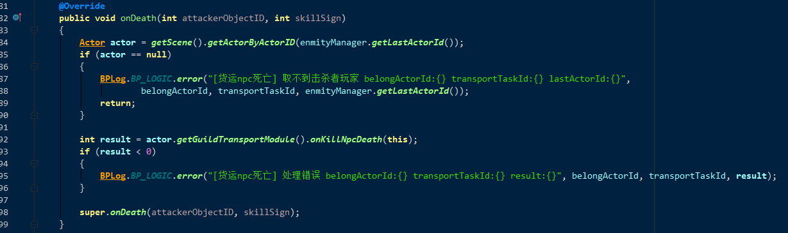

以及添加到场景上面的方法

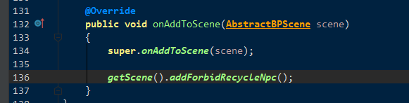

9. **如果是杀怪的任务,  刷完怪, 才会设置超时时间(由npc配置  getKeepTime() 控制) .    设置归属,  设置刷怪任务属性的值** 

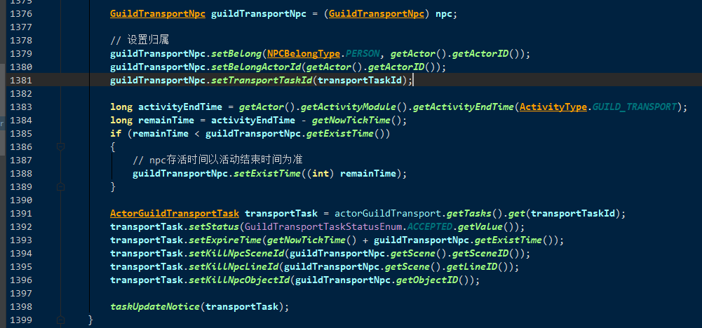

杀怪的任务.怪物被击杀后, 根据仇恨对象来判**断是自己的任务, 还是求助的任务.**  如果是求助的任务, 再次处理 求助的逻辑.  

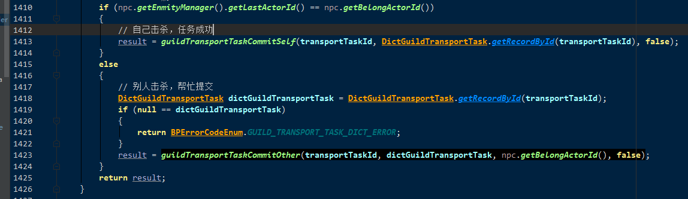

10. **货运任务提交. 也分为自己的和其他人的**  CSGuildTransportTaskCommit

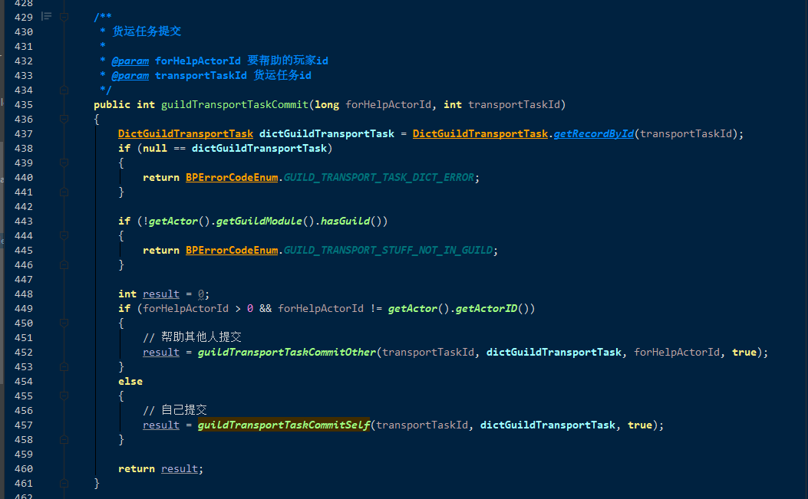

11. 活动结束会重置求助次数, 并且clear 生成的Task集合

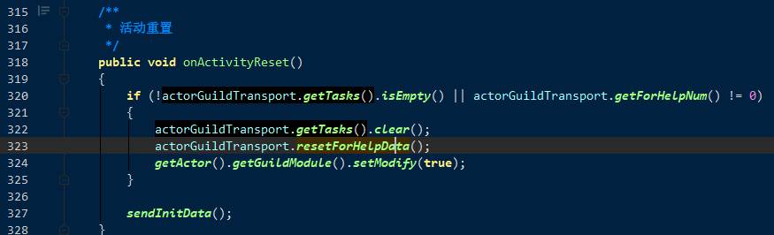

12. 光复大唐求助,  对话和小游戏不允许求助.  同帮派的才可以求助

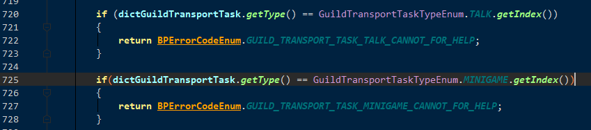

1.  光复大唐任务求助请求  CSGuildTransportTaskForHelp

   1. 会设置超时时间.  发送给帮派频道一个求助链接(使用 FlutterManager.getInstance().sendFlutterNoticeToGuildOnlineActor)
   2. 如果是杀怪的任务. 同时还会发送一个 **SW_GUILD_TRANSPORT_TASK_FOR_HELP_REQ** 消息给world, 并将此消息转发给怪物所在的场景(因为此时玩家可能不和怪物在同一场景)
   3. 
   4. 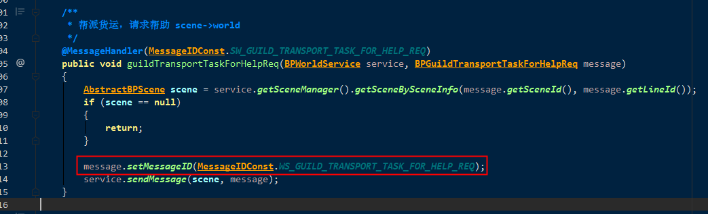

   5. 最后, 将此npc的belong属性, 修改为guild
   6. 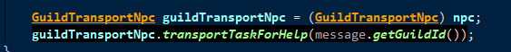

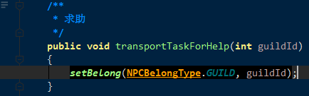

          7.	在Actor中的canBeAttack(AbstractCharacter attacker)方法中.  会对此belong属性进行验证. 以判断对方能否被攻击
             8.	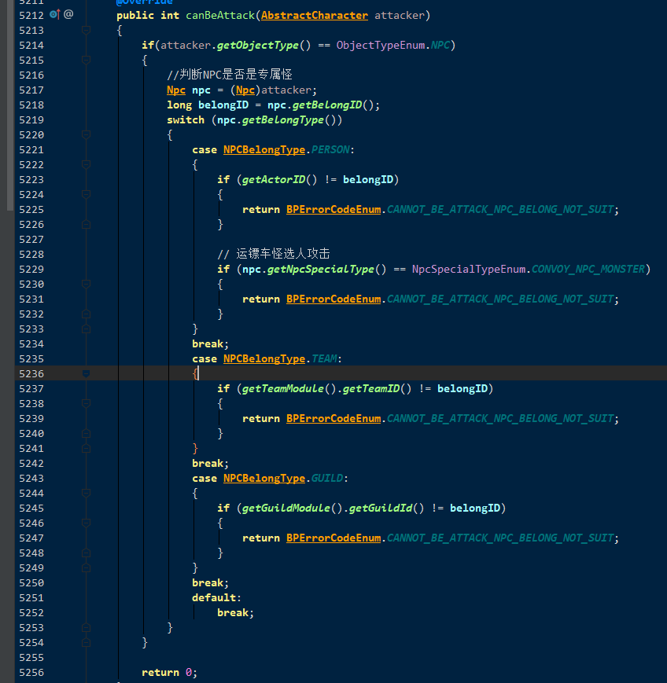
             9.	 任务失败. 则会设置Fail后, 刷新给客户端
                             1.	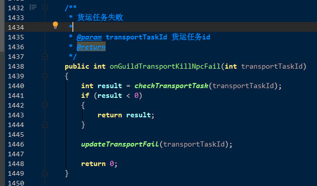
             10.	**提交他人的任务** .    被求助者提交任务.   逻辑有点复杂 (流程图见  https://processon.com/diagraming/5f72b337e401fd64b5e2a6d8)
                              1.	判断能否提交.  
                                              1.	杀怪任务是不能被提交的. 
                                              2.	非杀怪任务, 需要判断帮助次数.   如果帮助次数没有了. 是不允许提交的
                              2.	如果和求助玩家同一个场景.    (简单情况)
                                              1.	如果自己有帮助次数. 则会发送奖励
                                              2.	这个时候才会增加求助玩家的求助次数. 并且发送
                              3.	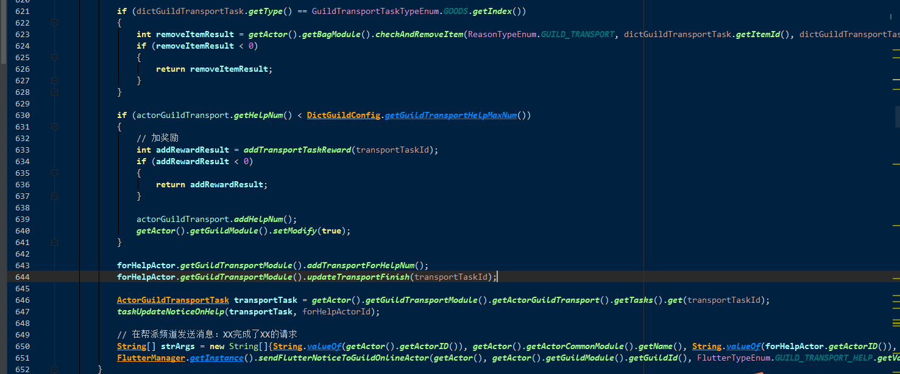
                              4.	 如果和求助玩家不在同一个场景. 
                              5.	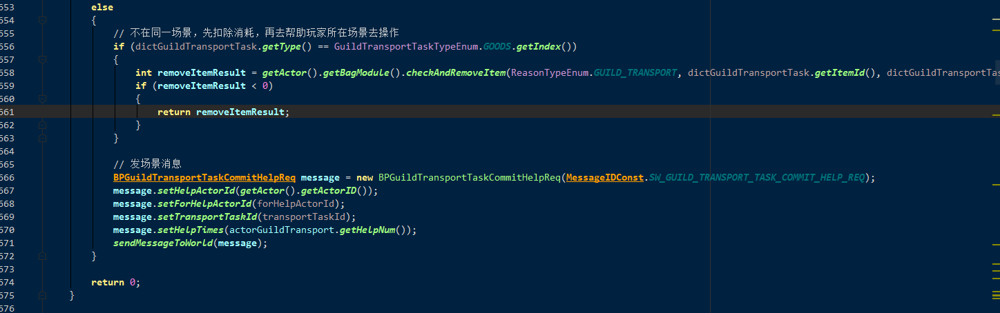
                              6.	到world上面之后. 
                              7.	根据类型区分逻辑. 
                                              1.	如果是杀怪类型的任务.  
                                                              1.	求助的玩家在线, 会将消息转发给玩家场景
                                                              2.	
                                                              3.	如果不在线, 则会添加离线事件
                                                              4.	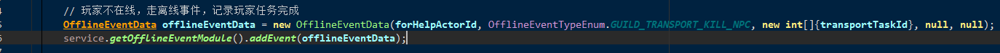
                                              2.	如果不是. (这里原来的逻辑有bug)
                              8.	会首先判断求助的玩家在不在线. 在线就转发到求助玩家场景. 
             11.	