### 技能

技能扫敌 常量

```java
class SkillScopeConstant
{
    public static final int NONE = 0; // 无效
    public static final int SINGLE = 1; // 单体
    public static final int CIRCLE = 2; // 圆形
    public static final int RECTANGLE = 3; // 矩形
    public static final int SECTOR = 4; // 扇形
    public static final int VOID = 5; // 空打击点(用于补足主动位移的打击点)
    public static final int RING = 6; // 环形
}
```

#### 矩形目标选择

1. 最简单的方法, 使用极坐标, 然后判断是否在范围内

   1. 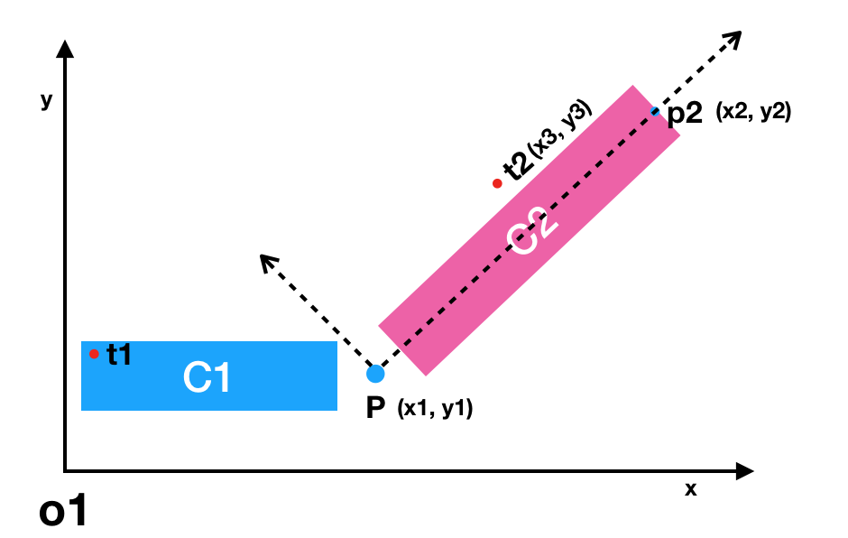
   2. 如果把施法者p到受击者p2之间的向量看成是新的x轴方向（虚线所示的相对坐标系），则被测试点与矩形的关系就可以用上术方法来判断。下面介绍如何把t2的坐标转换到pp2为x轴的相对坐标。
   3. 思路：通过求出被测点t2的极坐标，再通过极坐标转直角坐标就得到了t2的相对坐标，
   4. 极坐标定义：该坐标系中任意位置可由一个夹角和一段相对原点(极点)的距离来表示，例如pt可以表示为(|pt|, t2pp2度数)
   5. 
   6. 在本例中，已知p和t2的坐标，则|pt2|的值为径向坐标；因为已知三角形pt2p2的三边，根据余弦定理可求出角t2pp2的角度，即极坐标的角坐标
   7. 根据余弦定理：`a^2 = b^2 + c^2 - 2bccosθ`
      得：`cosθ = b^2 + c^2 - a^2 / 2bc`
      其中：`a`为`t2p2, b为pt2, c为pp2,θ为角t2pp2`
   8. 根据极坐标与直角坐标转换公式可得：
      假设t2的相对坐标为`(tr.x, tr.y)`则 `tr.x = pt2costθ`  `tr.y = sqrt(pt2^2 - tr.x^2)`
   9. 知道相对坐标，用平行坐标轴的算法很容易求出点是否是矩形内。

2. 第二种方法, 判断是否在长方形内

   1.  还是这个图

   2. 

   3.  Pt2之间的距离为L.   使用P的rotation, 减去t2P和水平线的夹角,  获得t2PP2的夹角α.  然后计算sin和cos.  判断是否  abs(sin(α) * L) <= 矩阵C2的宽的一半. 以及cos(α) * L 是否 <= PP2的长度

   4. ```java
      class RectVisionConsumer implements IUnitConsumer
      {
          private List<BPObject> list;
      
          private int x;
          private int z;
          private int rotation;
      
          private int rx;
          private int rz;
      
          private int height;
      
          private int halfWidth;
      
          private int[] re = new int[2];
      
          private long dsq;
      
          /**
           * 是否是攻击扫描
           */
          private boolean isFightScan = false;
      
          public RectVisionConsumer(BPObject unit, int width, int height, List<BPObject> list)
          {
              this.list = list;
      		
              // 技能发起者的坐标
              this.x = unit.getX();
              this.z = unit.getZ();
              this.rotation = unit.getRotation();
      		
              // 因为这里技能会能向后打一部分, 所以根据角度重新结算位置
              MapUtils.polar(DictGameConfig.getVisionBackLength(), this.rotation, re);
      
              rx = this.x - re[0];
              rz = this.z - re[1];
      		// 技能范围宽度的一半
              this.halfWidth = width / 2;
      		// 技能范围最终长度
              this.height = height + DictGameConfig.getVisionBackLength();
      		// 技能的对角的平方和
              dsq = (long) width * (long) width / 4 + (long) this.height * (long) this.height;
      
              if (unit instanceof AbstractCharacter)
              {
                  AbstractCharacter character = (AbstractCharacter) unit;
                  if (character.getSkillModule().isUsingSkill() && character.getFightModule().isFightStatus())
                  {
                      isFightScan = true;
                  }
              }
          }
      
          @Override
          public void accept(BPObject unit)
          {
              // 目标的x,y
              int ux = unit.getX();
              int uy = unit.getZ();
      		
              // 自己和目标的距离平方和
              float distanceSQ = MapUtils.distanceSqBetweenPos(rx, rz, ux, uy);
              float beHitDistanceSQ = distanceSQ;
              float distance = -1;
              float beHitDistance = -1;
      
              if (isFightScan)
              {
                  if (unit.isCloseBeHit())
                  {
                      return;
                  }
                  distance = (float) Math.sqrt(distanceSQ);
                  beHitDistance = unit.getBeHitDistance(distance);
                  beHitDistanceSQ = beHitDistance * beHitDistance;
              }
      
              // dsq就是最长的距离
              if (beHitDistanceSQ <= dsq)
              {
                  if(beHitDistance < 0)
                  {
                      beHitDistance = (float) Math.sqrt(beHitDistanceSQ);
                  }
      
                  // 计算目标和自己的夹角的 高和宽
                  int rotationA = this.rotation - MapUtils.rotationBetweenPos(rx, rz, ux, uy);
                  double radiansA = Math.toRadians(rotationA);
                  double h = Math.cos(radiansA) * beHitDistance;
                  double w = Math.sin(radiansA) * beHitDistance;
      			
                  // 如果 小于一半的宽. 并且小于长度. 则说明在长方形内
                  if (Math.abs(w) <= halfWidth)
                  {
                      if (h >= 0 && h <= height)
                      {
                          list.add(unit);
                      }
                  }
              }
          }
      }
      ```

      

      #### 扇形 

      1. 判断点是否在扇形中的方法很多，本文介绍通过点积来判断:
         点积代数定义：`a·b = a.x * b.x + a.y * b.y`
         点积几何定义：`a·b = |a||b|cosθ` (θ为ab之前的夹角)
      2. 如下图所行，u为施法者朝向，t为被攻击者坐标，θ为扇形角度的1/2, 下面我们要判断点t是否在扇形区域内。
      3. 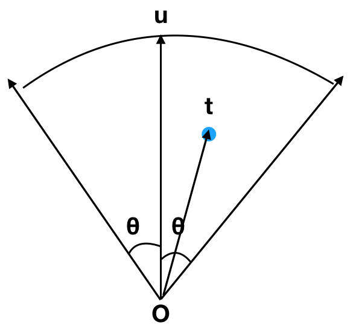
      4. 步骤：
         - 首先判断ot的距离是否<扇形半径，若是进入第2步
         - 判断u与ot之前的夹角θt是否<θ,方法如下：
           因为cosθ在[0,π]区间单调递减，如下图所示：

   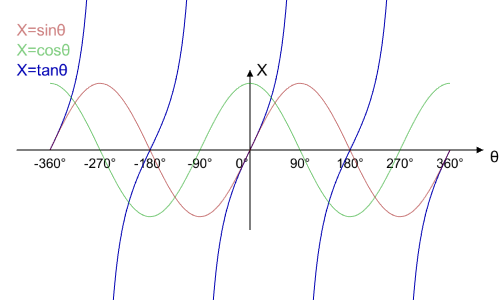

   ​        所以只需要判断`cosθt > costθ`即可。u点和t点的坐标是已知的，因此根据点积公式很容易求出`cosθt、cosθ`。


点积（对应元素相乘相加）


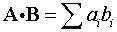

结果是一个数！

几何意义：投影


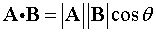

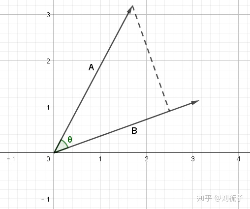

为什么数值计算的结果就代表几何上的投影呢？

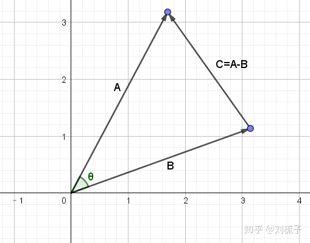

利用余弦定理：

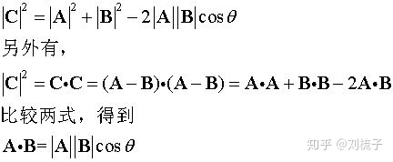


2.点乘应用

2.1计算长度和角度

利用点积找角度很简单，这里就不举例了。

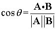

2.2检测正交性

当角度为90度时，即点积为0时，两个向量正交。

举例：满足x+2y+3z=0的点组成的图形是？

答：是一个平面，向量(x,y,z)与向量(1,2,3)正交，因此组成一个过原点的平面，向量(1,2,3)是其法向量。

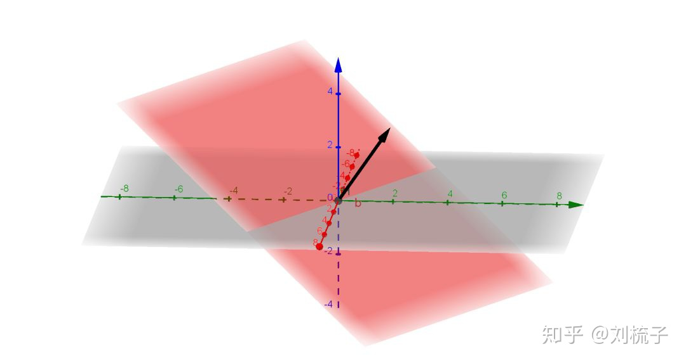

2.3 求三角形面积

问题：求任给多边形的面积，多边形给出了每个定点坐标？

答案：先把所有的多边形分解成多个三角形，然后只要能求出三角形面积，问题就解决了。

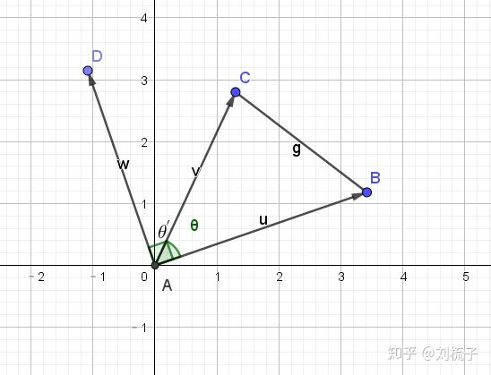

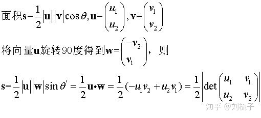


