### 潜入分舵

1. 潜入分舵.
   1. 首先需要建立帮派,  回到自己帮派. 去找擂台边上的npc对话.  
   2. 点击潜入分舵后,  客户端会发送  CSAcceptLoopTask 请求
   3. 目前潜入分舵在服务器上叫做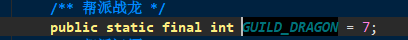

   4. 这样会开始下面的逻辑	

   5. 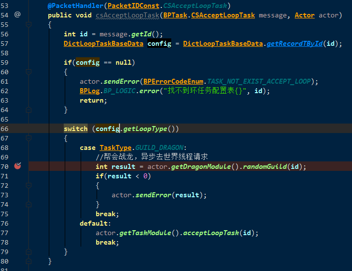

   6. 在world上面 随机guildId, 设置相应的值并返回 

      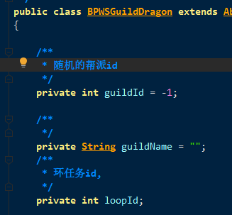

   7. 场景上面处理这个消息, 首先设置到玩家的信息中(落地),  然后开始执行 接受这个loopId的任务方法调用

   8. 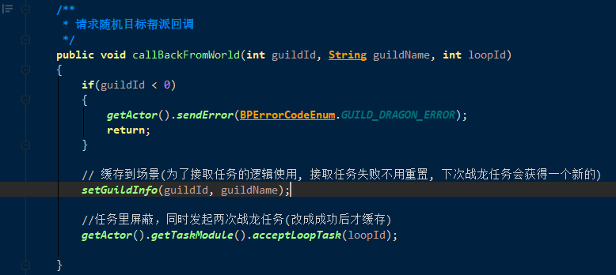

9. 接取任务的时候,  初始化任务数据的时候, 需要给任务目标数据额外赋值
10. 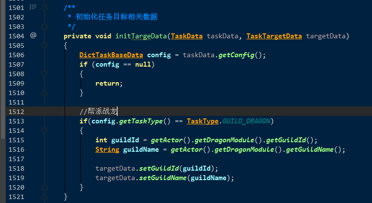

11. 接取成功后,  会通知world, 让world记录下  玩家id 和帮派id的对应关系. 以便处理工会解散的逻辑

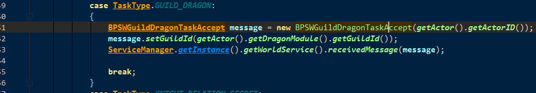

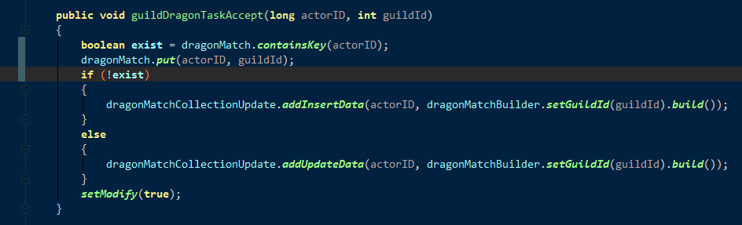

12. 关于任务刷怪.  TaskModule里面有个OnEnterScene的回调. 里面有对需要刷怪任务的处理
13. 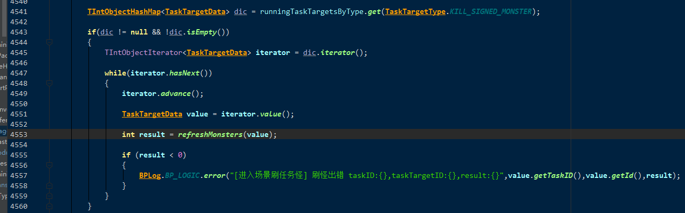

14.  根据存储的guildId, 刷怪
15. 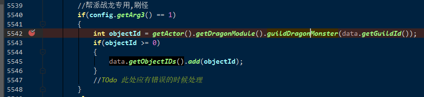

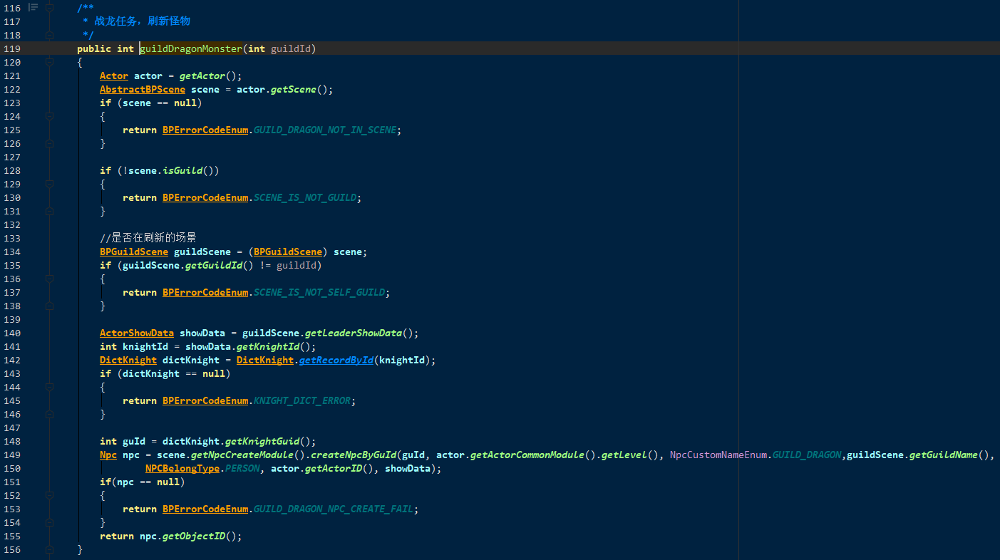

接受环任务后, 会本身接取一个任务, 并且设置环任务数据 LoopTaskData.  

每一个步骤. 客户端发送CSTaskStep.

完成任务后, 跑回npc处, 客户端会发送CSCommitTask来进行完成任务提交

16.**放弃或者完成任务**

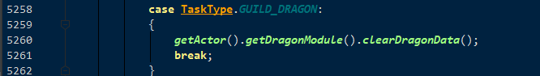

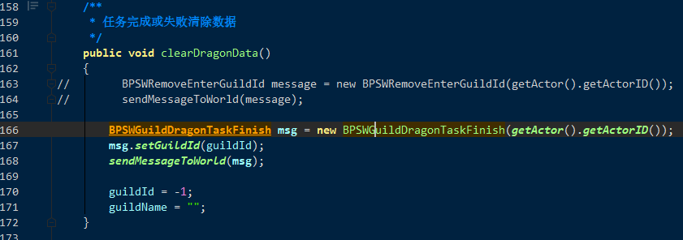

环任务次数重置刷新,   TaskModule  secondTick()

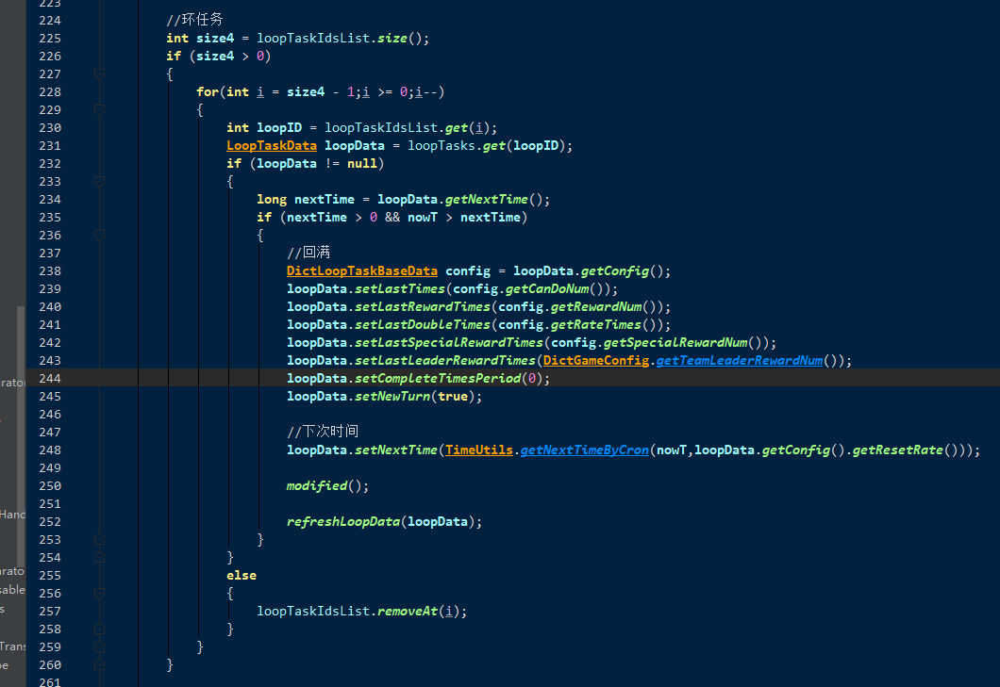