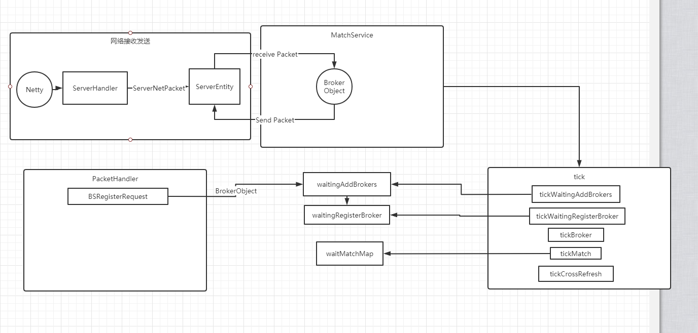

#### Match

1.  Match服务 boot启动. 
   1. 注册packet和message,以及web的处理器
   2. 启动MainProcessor, 等待逻辑service加入ProcessPool
   3. 从spring中取出MatchService实例,  加入ProcessPool
   4. 读取网络配置,  然后从主服读取配置
   5. 设置MatchService的 服务器配置(listenIp, listenPort, InnerServerID)
   6. 雪花算法初始化服务器id
   7. 启动netty服务器, 等待接收


2. 逻辑处理架构

3. 

4. MatchService.tick()

5. ```java
   tickWaitingAddBrokers(interval);
   
   tickWaitingRegisterBroker(interval);
   
   tickBroker(interval);
   
   tickMatch(interval);
   
   tickCrossRefresh(interval);
   ```

​     

```java
@Override
public void newConnected(AbstractLoginObject object)
{
    waitingAddBrokers.add((BrokerObject) object);
}
```


```java
/**
 * tick处理待加入的broker服务
 * @param interval
 */
private void tickWaitingAddBrokers(int interval)
{
    if (waitingAddBrokers.isEmpty())
    {
        return;
    }

    BrokerObject brokerObject = waitingAddBrokers.poll();
    brokerObject.setService(this);
    if (brokerObject != null)
    {
        waitingRegisterBroker = brokerObject;
    }
}
```


```java
/**
 * tick处理注册
 *
 * @param interval
 */
private void tickWaitingRegisterBroker(int interval)
{
    if (waitingRegisterBroker == null)
    {
        return;
    }

    boolean isRegister = waitingRegisterBroker.processRegister(interval);
    if (isRegister)
    {
        brokerObject = waitingRegisterBroker;
        MatchLog.MATCH.info("broker已经注册成功");
        waitingRegisterBroker = null;
    }

    if (waitingRegisterBroker != null && waitingRegisterBroker.getExceptionEnum() != ObjectExceptionEnum.NONE)
    {
        MatchLog.MATCH.info("broker异常, exception:{}", waitingRegisterBroker.getExceptionEnum());
        waitingRegisterBroker = null;
        return;
    }
}
```


```java
/**
 * tick处理broker
 * @param interval
 */
private void tickBroker(int interval)
{
    if (brokerObject == null)
    {
        return;
    }

    if (brokerObject.getExceptionEnum() != ObjectExceptionEnum.NONE)
    {
        MatchLog.MATCH.warn("broker出现异常, 删除broker, 清除所有服务信息");
        clear();
        return;
    }

    brokerObject.processInput(interval);

    brokerObject.processOutput(interval);
}
```


```java
/**
 * tick处理cross的负载刷新
 *
 * @param interval
 */
private void tickCrossRefresh(int interval)
{
    if (crossOverloadRefreshSet.isEmpty())
    {
        return;
    }

    TIntIterator iterator = crossOverloadRefreshSet.iterator();
    while (iterator.hasNext())
    {
        int logicZoneID = iterator.next();
        LinkedList<CrossObject> crossObjects = crossOverloadMap.get(logicZoneID);
        if (crossObjects == null)
        {
            continue;
        }

        crossObjects.sort(crossOverloadSort);
    }
}
```


关于 MatchService 的 Classloader的热更新方案

需要 替换整个逻辑. 还要注意缓存对象有可能会引用着原来的对象, 导致旧的class卸载不掉