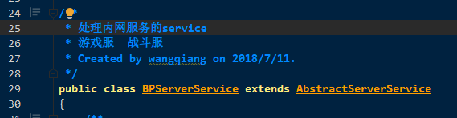
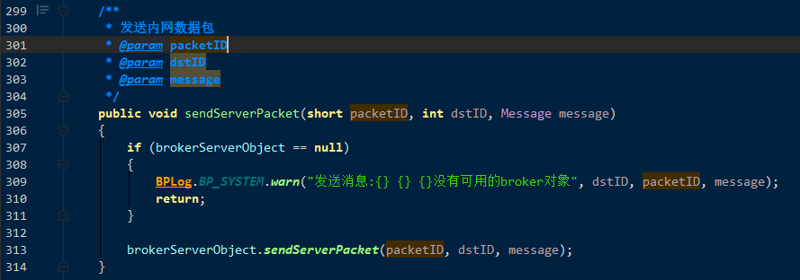
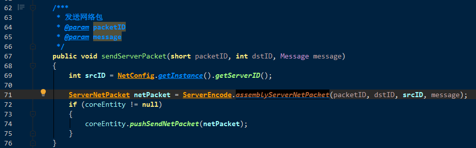

### 跨服战场

每个独立的服, 都有一个处理mesh服务连接的service类.(相当于 broker的 Proxy)



​	里面会有一个broker的长连接, 以及一个ServerCrossModule , 并且维护了其他服的目标. (注册中心刷新回来的缓存)

```java
public class BPServerService extends AbstractServerService
{
    /**
     * 以组为单位存储内网服务对象id
     * key: 服务类型id, value:所有该类型的内网服务对象
     */
    private TIntObjectHashMap<TIntArrayList> innerServerGroupMap = new TIntObjectHashMap<>();

    /**
     * 可以通信的所有内网服务id
     */
    private TIntHashSet innerServerIDs = new TIntHashSet();

    /**
     * 待增加的内网服务对象
     */
    private ConcurrentLinkedQueue<ServerObject> waitAddQueue = new ConcurrentLinkedQueue<>();

    /**
     * 未注册的内网服务对象
     */
    private LinkedList<ServerObject> unregisterList = new LinkedList<>();

    /**
     * 当前使用的broker服务对象
     */
    private ServerObject brokerServerObject;

    /////////////////////////////////////////////////////////////////////////////

    /**
     * 跨服模块
     */
    private ServerCrossModule crossModule = new ServerCrossModule(this);
}
```


1. Broker 启动 .
   1.  MasterService类. 
      1.   使用Http服务从 主服获取配置服链接. Broker作为客户端和各个服建立链接. 发送BSRegisterRequest 来请求注册
   2.  WorkService类. 
      1. 用来转发协议


### 战场Packet请求  ActorWarGroundPacketHandler

1. 报名  CSSignUpWarGround   (本机)

   1. 成功后 加入 玩家报名场次

2. 确认报名 CSConfirmSignUp (本机)

   1. 成功后 加入World 报名列表.  失败才返回scene消息.
   2. 并且发送报名信息, 通过 serverObject发送到Match 服 . **但是这里没有等待返回结果, 就直接当成成功处理了. 其实是有问题的**

3. 取消报名   CSCancelSignUpWarGround (本机)

   1. 成功后去掉自己的注册场次

4. 查看战场信息    CSWarGroundSituationInfo (战场 镜像服)

   1. 得到红蓝双方信息

5. 退出战场 CSExitWarGround (战场, 镜像服)

   1. 最后会调用 ActorCrossModule的 crossGameOver()方法

   2. 构造SS_CROSS_GAMEOVER_NOTICE 需要的信息, 发送到 mesh服务中, 并转化msg为Packet,准备通过broker来进行中转

   3. mesh 服务 通过 brokerServerObject对象 将Packet发送给broker.

      

   

   ​						

   

   ​	

   1.  跨服玩法结束 镜像服通知游戏服   MGCrossGameOverNotice
   2. 跨服玩法结束 镜像服通知match  MMCrossGameOverNotice


**Matcher服 GMMatchRequest请求中的matchService 是怎么来的, 怎么区分给哪个Game发送packet**, 应该和Matcher服的解码, 分发有关系


登录镜像服协议 GMLoginMirrorRequest
