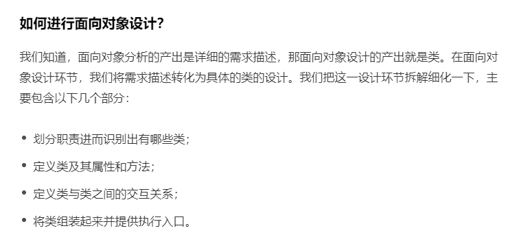

### 代码优化

1. 优先使用使用对象池 重用对象 (ObjectPool池)

2. 对于会频繁分配的代码, 优先分配一大堆. 然后再一点一点的使用  (TLAB,  名字生成)

3. 对于高竞争的volatile字段, 1.8以上可以使用@contend注解来处理

   ```toml
   * JVM参数：-XX:-RestrictContended -XX:+PrintFlagsFinal
   * -RestrictContended: 使 @sun.misc.Contended 注解生效 （注解意义：自动补齐缓存行）
   * -XX:+PrintFlagsFinal：打印JVM参数状态
   ```

4. 遍历Collection.可以分成RandomAccess接口(使用索引)和 Iterator接口(使用迭代器)分开处理

5. 

   1. ​	特别注意  接口和接口之间的分界线