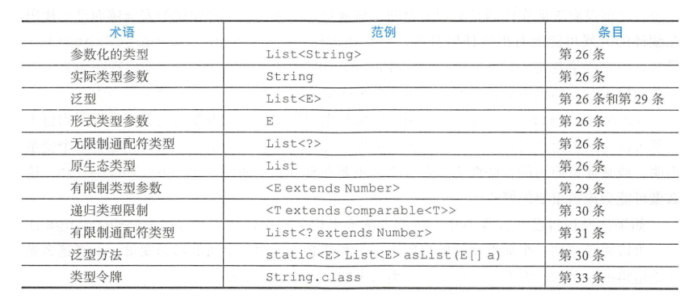

## Java 泛型

1. List 和 List<Object> 不一样
2. Set 和 Set<?> 不一样   Set<?>安全, Set不安全
   1. Set<?> 只允许存放null,  而Set允许放入任何值
3. 总结
   1. Set<Object> 是个 **参数化类型**, 表示可以包含任何对象类型的一个集合
   2. Set<?> 则是一个 **通配符类型**, 表示只能包含某种未知对象类型的一个集合
   3. Set 是一个原生态类型, 脱离了泛型系统
   4. 前两种是安全的, 最后一种不安全
4. 
5.  有些警告非常难以消除. 当你遇到需要进行一番思考的警告时, 要坚持住! **要尽可能的消除每一个非首检警告. 如果消除了所有的警告, 就确保代码是类型安全的**.

###  列表优于数组

1. 数组是协变的, 表示如果Sub为Super的子类型, 那么数组类型Sub[]就是Super[]的子类型
2. 对于任意的类型 Type1, Type2.  List<Type1> 既不是List<Type2>的子类型, 也不是List<Type2>的超类型
3. 

