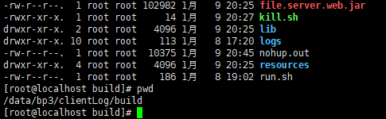
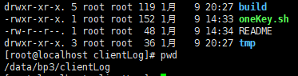

## 客户端上传日志  部署

#### 部署流程 (备忘)

2. 运行pom.xml打包,  打包之后所有的东西都在target/build目录下.  
   1. 将 build目录 打包成zip.  得到  build.zip
3. 部署jar
   1. 172.16.2.60   root  bp3@qawsed   
   2. 进入 /data/bp3/clientLog/build 目录,  运行 sh kill.sh 将目前的进程杀掉
   3. 
   4. 进入 /data/bp3/clientLog/tmp  目录,  如果存在build.zip ,  运行 rm -f build.zip 删除
   5. 上传刚打包好的 build.zip
   6. cd ..   退回上一层目录
   7. 
   8. 运行 sh oneKey.sh
   9. 进入 /data/bp3/clientLog/build 目录 运行 sh run.sh 启动web程序
   10. 部署完毕

本地调试,  需要增加参数    --spring.profiles.active=blrdev

#### 查看日志网页

网页地址	http://172.16.2.60:8080/

#### 测试上传网页

网页地址   http://172.16.2.60:8082/getUploadHtml

客户端上传的时候的发送地址

frame 日志    http://172.16.2.60:8082/blrFrameSyncLogFiles

log 日志   http://172.16.2.60:8082/blrUploadLog

