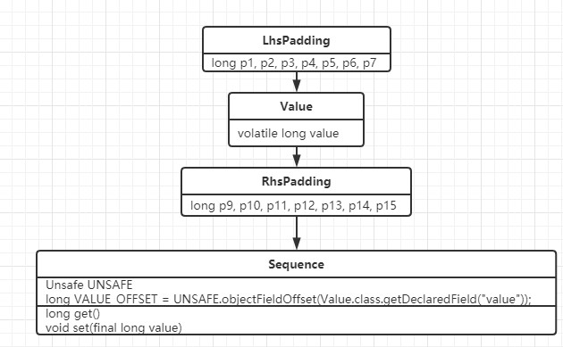

### Disruptor 源码

1.  Disruptor

   1. ```java
      该类其实是个门面，用于帮助用户组织消费者。
      ```

   2. ```java
      * 2.{@link #handleEventsWith(EventHandler[])}
      *   {@link #handleEventsWith(EventProcessor...)}
      *   {@link #handleEventsWith(EventProcessorFactory[])}
      *   所有的 {@code handleEventsWith} 都是添加消费者，每一个{@link EventHandler}、
      *   {@link EventProcessor}、{@link EventProcessorFactory}都会被包装为一个独立的消费者{@link BatchEventProcessor}
      *   数组长度就代表了添加的消费者个数。
      ```

   3. ```java
      * 3.{@link #handleEventsWithWorkerPool(WorkHandler[])} 方法为添加一个多线程的消费者，这些handler共同构成一个消费者.
      *   （WorkHandler[]会被包装为 {@link WorkerPool}，一个WorkPool是一个消费者，WorkPool中的Handler们
      *   协作共同完成消费。一个事件只会被WokerPool中的某一个WorkHandler消费。
      *   数组的长度决定了线程池内的线程数量。
      ```

2. Sequence: 序列器,Sequence本身提供了类似AtomicLong的各个特性, 可以认为就是一个long值

   1.  
   2.  生产者,消费者都是这个类的使用者,每个使用者都会维护一个Sequence来标识自己的读/写下标。,disruptor里面大部分的并发代码都是通过对Sequence的值同步修改实现的,而非锁,这是disruptor高性能的一个主要原因.

   2. ```java
      VALUE_OFFSET = UNSAFE.objectFieldOffset(Value.class.getDeclaredField("value"));
      ```

      取到value的偏移值, 然后使用unsafe来代替volatile

   3.  ```java
       public Sequence(final long initialValue)
       {
           // 这里使用Ordered模式写入就可以保证：对象的发布操作不会重排序到对象构造完成前（其它线程不会看见构造未完成的对象）。
           // 会比volatile开销低一些
           UNSAFE.putOrderedLong(this, VALUE_OFFSET, initialValue);
       }
       ```

       这段的意思应该就是指 new对象的时候, 如果不加volatile的话, 指令重排序会导致获取到未初始化的对象

   4.  

       ```java
       /**
       * 对sequence执行一个Ordered模式写操作,而不是volatile模式写操作。
       * 目的是在当前写操作和之前的写操作直接插入一个StoreStore屏障,保证屏障之前的写操作先于当前写操作
       * 对其他CPU可见。(减少内存屏障的消耗，StoreLoad屏障消耗较大)
          * <p>
          * 在J9中，对内存屏障的使用进行了规范，用{@code setRelease}代替了LazySet/putOrdered叫法。
          * （对应C++ 11中的Release Acquire模式）
       *
       * 更多内存屏障/内存栅栏信息请查阅资料。
          * （建议看一下J9的VarHandle类）
       *
          * Perform an ordered write of this sequence.  The intent is
          * a Store/Store barrier between this write and any previous
          * store.
          *
          * @param value The new value for the sequence.
          */
         public void set(final long value)
         {
             UNSAFE.putOrderedLong(this, VALUE_OFFSET, value);
         }
       ```

   5.  ```java
       /**
       * 执行一个volatile写操作。
       * 目的是在当前写操作与之前的写操作之间插入一个StoreStore屏障，在当前写操作和
       * 后续的任意volatile变量读操作之间插入一个StoreLoad屏障，保证当前的volatile写操作
       * 对后续的volatile读操作立即可见。
       *
       * 更多内存屏障/内存栅栏信息请查阅资料。
       *
          * Performs a volatile write of this sequence.  The intent is
          * a Store/Store barrier between this write and any previous
          * write and a Store/Load barrier between this write and any
          * subsequent volatile read.
          *
          * @param value The new value for the sequence.
          */
         public void setVolatile(final long value)
         {
             UNSAFE.putLongVolatile(this, VALUE_OFFSET, value);
         }
       ```

       注意, 这2个的区别是 4中少插入了一个StoreLoad,  使用volatile会在语句前插入 StoreStore, 在语句后插入StoreLoad, 而StoreLoad比较消耗资源

   6.  

3. Unsafe 

   1. 获取Unsafe

   2. ```java
      private static final Unsafe THE_UNSAFE;
      
      static
      {
          try
          {
              final PrivilegedExceptionAction<Unsafe> action = new PrivilegedExceptionAction<Unsafe>()
              {
                  public Unsafe run() throws Exception
                  {
                      Field theUnsafe = Unsafe.class.getDeclaredField("theUnsafe");
                      theUnsafe.setAccessible(true);
                      return (Unsafe) theUnsafe.get(null);
                  }
              };
      
              THE_UNSAFE = AccessController.doPrivileged(action);
          }
          catch (Exception e)
          {
              throw new RuntimeException("Unable to load unsafe", e);
          }
      }
      
      // 获取Unsafe
      public static Unsafe getUnsafe()
      {
          return THE_UNSAFE;
      }
      ```

  4. Sequencer:  disruptor里生产同步的实现者,Sequencer有单生产者,多生产者两种不同的模式,里面实现了各种同步的算法
     	
1. 
     	
  5. 