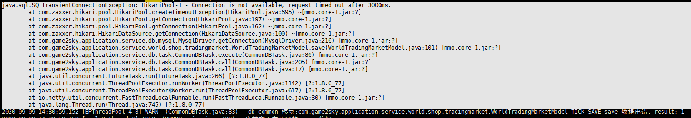

#### 微观上 HiKariCP 程序编译出的字节码执行效率更高，站在字节码的角度去优化 Java 代码。而宏观上主要是和两个数据结构有关，一个是 FastList，另一个是 ConcurrentBag。

### FastList 解决了哪些性能问题
HiKariCP 觉得用 ArrayList 还是太慢。 因为 当通过 stmt.close() 关闭 Statement 的时候，需要调用 ArrayList 的 remove() 方法来将其从 ArrayList 中删除，这里是有优化余地的。

假设一个 Connection 依次创建 6 个 Statement，分别是 S1、S2、S3、S4、S5、S6，按照正常的编码习惯，关闭 Statement 的顺序一般是逆序的，关闭的顺序是：S6、S5、S4、S3、S2、S1，而 ArrayList 的 remove(Object o) 方法是顺序遍历查找，逆序删除而顺序查找，这样的查找效率就太慢了。如何优化呢？很简单，优化成逆序查找就可以了。HiKariCP 中的 FastList 相对于 ArrayList 的一个优化点就是将remove(Object element) 方法的查找顺序变成了逆序查找。除此之外，FastList 还有另一个优化点，是 get(int index) 方法没有对 index 参数进行越界检查，HiKariCP 能保证不会越界，所以不用每次都进行越界检查。

FastList 删除对象的时候, 是逆序查找
``` java
public boolean remove(Object element)
{
   for (int index = size - 1; index >= 0; index--) {
      if (element == elementData[index]) {
         final int numMoved = size - index - 1;
         if (numMoved > 0) {
            System.arraycopy(elementData, index + 1, elementData, index, numMoved);
         }
         elementData[--size] = null;
         return true;
      }
   }
   return false;
}
```
而ArrayList的删除对象是顺序查找的
```java
public boolean remove(Object o) {
        if (o == null) {
            for (int index = 0; index < size; index++)
                if (elementData[index] == null) {
                    fastRemove(index);
                    return true;
                }
        } else {
            for (int index = 0; index < size; index++)
                if (o.equals(elementData[index])) {
                    fastRemove(index);
                    return true;
                }
        }
        return false;
    }
```
FastList中的get方法, 没有进行越界检查. 注释上说明是允许抛出越界异常的
```java
   /**
    * Get the element at the specified index.
    *
    * @param index the index of the element to get
    * @return the element, or ArrayIndexOutOfBounds is thrown if the index is invalid
    */
   @Override
   public T get(int index)
   {
      return elementData[index];
   }
```


#### ConcurrentBag 解决了哪些性能问题

###### BlockingQueue 阻塞队列是用锁实现的，而高并发场景下锁的争用对性能影响很大。

###### HiKariCP 并没有使用 Java SDK 中的阻塞队列，而是自己实现了一个叫做 ConcurrentBag 的并发容器。它的一个核心设计是使用 ThreadLocal 避免部分并发问题, 下面我们来看看它是如何实现的。

###### ConcurrentBag 中最关键的属性有 4 个，分别是：用于存储所有的数据库连接的共享队列 sharedList、线程本地存储 threadList、等待数据库连接的线程数 waiters 以及分配数据库连接的工具 handoffQueue。其中，handoffQueue 用的是 Java SDK 提供的 SynchronousQueue，SynchronousQueue 主要用于线程之间传递数据。

```java
// 用于存储所有的数据库连接
CopyOnWriteArrayList<T> sharedList;
// 线程本地存储中的数据库连接
ThreadLocal<List<Object>> threadList;
// 等待数据库连接的线程数
AtomicInteger waiters;
// 分配数据库连接的工具
SynchronousQueue<T> handoffQueue;
```

当线程池创建了一个数据库连接时，通过调用 ConcurrentBag 的 add() 方法加入到 ConcurrentBag 中，下面是 add() 方法的具体实现，逻辑很简单，就是将这个连接加入到共享队列 sharedList 中，如果此时有线程在等待数据库连接，那么就通过 handoffQueue 将这个连接分配给等待的线程。

```java
public void add(final T bagEntry)
{
   if (closed) {
      LOGGER.info("ConcurrentBag has been closed, ignoring add()");
      throw new IllegalStateException("ConcurrentBag has been closed, ignoring add()");
   }

   sharedList.add(bagEntry);

   // spin until a thread takes it or none are waiting
   /*
   	如果有等待数据库连接的线程, 并且这个bagEntry没有被其他人使用, 就加入到handoffQueue中, 让等待连接的线程去获取. 如果加入失败, 就不停重试.
   	重试的时候, 会不停的调用yield().
   	这里如果不想出现锁, 那么就要要求 handoffQueue这种SynchronousQueue要比 BlockingQueue 快的多, 否则没有任何意义
   */
   while (waiters.get() > 0 && bagEntry.getState() == STATE_NOT_IN_USE && !handoffQueue.offer(bagEntry)) {
      Thread.yield();
   }
}
```

#### Thread.yield()

当前线程从运行状态变成就绪状态, 以便和其他线程能重新竞争cpu的运行机会.  

理解为当while(true)的时候, 会长时间占用cpu, 这个时候如果有别的任务, 那么可以让别的任务也参与竞争cpu

## yield 和 sleep 的异同

1）yield, sleep 都能暂停当前线程，sleep 可以指定具体休眠的时间，而 yield 则依赖 CPU 的时间片划分。

2）yield, sleep 两个在暂停过程中，如已经持有锁，则都不会释放锁资源。

3）yield 不能被中断，而 sleep 则可以接受中断。

---

通过 ConcurrentBag 提供的 borrow() 方法，可以获取一个空闲的数据库连接，borrow() 的主要逻辑是：

1. 首先查看线程本地存储是否有空闲连接，如果有，则返回一个空闲的连接；

   ```java
   // Try the thread-local list first
         final List<Object> list = threadList.get();
         for (int i = list.size() - 1; i >= 0; i--) {
            // 这里直接使用了remove, 好狠.
            final Object entry = list.remove(i);
            @SuppressWarnings("unchecked")
            final T bagEntry = weakThreadLocals ? ((WeakReference<T>) entry).get() : (T) entry;
             // 如果不为null, 并且成功修改状态后返回. 如果修改状态不成功, 丢弃啦
            if (bagEntry != null && bagEntry.compareAndSet(STATE_NOT_IN_USE, STATE_IN_USE)) {
               return bagEntry;
            }
         }
   ```

2. 如果线程本地存储中无空闲连接，则从共享队列中获取。

3. 如果共享队列中也没有空闲的连接，则请求线程需要等待。

4. ```java
    // Otherwise, scan the shared list ... then poll the handoff queue
         final int waiting = waiters.incrementAndGet();
         try {
            for (T bagEntry : sharedList) {
               if (bagEntry.compareAndSet(STATE_NOT_IN_USE, STATE_IN_USE)) {
                  // If we may have stolen another waiter's connection, request another bag add.
                  // 偷了别人的一个, 需要生成一个放回去. 
                  // sharedList 是 CopyOnWriteArrayList. 因为需要允许循环的时候添加对象
                  if (waiting > 1) {
                     // 这里提交一个异步的任务. 该任务会执行上面的add方法, 从而往sharedList中添加一个bagEntry. 所以需要遍历的时候也能改变集合
                     listener.addBagItem(waiting - 1);
                  }
                  return bagEntry;
               }
            }
      		
            // 如果共享里面也没有获取到. 则说明真的没有了. 异步创建任务,加入队列
           listener.addBagItem(waiting);
       
            timeout = timeUnit.toNanos(timeout);
            do {
               final long start = currentTime();
               final T bagEntry = handoffQueue.poll(timeout, NANOSECONDS);
               if (bagEntry == null || bagEntry.compareAndSet(STATE_NOT_IN_USE, STATE_IN_USE)) {
                  return bagEntry;
              }
       
               timeout -= elapsedNanos(start);
           } while (timeout > 10_000);
       
            return null;
         }
         finally {
            waiters.decrementAndGet();
        }
    ```
```
    
    #### 这种异步增加任务是为了什么?  就是为了请求到来的同时, 也会有新的创建bagEntry一直不停的再运行, 新来的请求可以更快的获得连接
    
    1. 比如一次到来10个连接. 那么waiting = 10.  而此时sharedList中并没有那么多可以返回的bagEntry. 此时首先执行新建任务, 在do while的地方等待被放入handoffQueue的任务.
    2. 新来的第11个连接, 这个时候就可以走到sharedList的循环中了, 开始偷连接了.(先来的太惨了, 要和其他先来的在do while中抢handoffQueue中的连接)
    
    3. 如果再也没有新连接到来. 那么在第11个的时候, 最终从handoffQueue中获取到, 返回
    
5.  


## 引用级别

##### 强 软 弱 虚
1. ###### 强  垃圾回收的时候, 没有被其他对象引用的时候会被回收. 

   1. 方法中new的堆对象会用栈变量引用, 方法结束后, 栈引用清除.  堆对象等待gc
   2. 当**内存空间不足**时，`Java`虚拟机宁愿抛出`OutOfMemoryError`错误，使程序**异常终止**，也不会靠随意**回收**具有**强引用**的**对象**来解决内存不足的问题
   3. 具体什么时候收集这要取决于`GC`算法。

2. ###### 软(SoftReference)   如果一个对象只具有**软引用**，则**内存空间充足**时，**垃圾回收器**就**不会**回收它；如果**内存空间不足**了，就会**回收**这些对象的内存。只要垃圾回收器没有回收它，该对象就可以被程序使用。

   1. ###### 软引用可用来实现内存敏感的高速缓存   LRU, 会优先回收最不常使用的缓存

   2. **软引用**可以和一个**引用队列**(`ReferenceQueue`)联合使用。如果**软引用**所引用对象被**垃圾回收**，`JAVA`虚拟机就会把这个**软引用**加入到与之关联的**引用队列**中。

   3. ```java
      ReferenceQueue<String> referenceQueue = new ReferenceQueue<>();
          String str = new String("abc");
          SoftReference<String> softReference = new SoftReference<>(str, referenceQueue);
```

   4. 当内存不足时，`JVM`首先将**软引用**中的**对象**引用置为`null`，然后通知**垃圾回收器**进行回收：

      ```java
      if(JVM内存不足) {
              // 将软引用中的对象引用置为null
              str = null;
              // 通知垃圾回收器进行回收
              System.gc();
          }
      ```

      也就是说，**垃圾收集线程**会在虚拟机抛出`OutOfMemoryError`之前回**收软引用对象**，而且**虚拟机**会尽可能优先回收**长时间闲置不用**的**软引用对象**。对那些**刚构建**的或刚使用过的**"较新的"**软对象会被虚拟机尽可能**保留**，这就是引入**引用队列**`ReferenceQueue`的原因。

   5. **应用场景：**

      浏览器的后退按钮。按后退时，这个后退时显示的网页内容是重新进行请求还是从缓存中取出呢？这就要看具体的实现策略了。

      1. 如果一个网页在浏览结束时就进行内容的回收，则按后退查看前面浏览过的页面时，需要重新构建；
      2. 如果将浏览过的网页存储到内存中会造成内存的大量浪费，甚至会造成内存溢出。

      这时候就可以使用软引用，很好的解决了实际的问题：

      ```java
      // 获取浏览器对象进行浏览
          Browser browser = new Browser();
          // 从后台程序加载浏览页面
          BrowserPage page = browser.getPage();
          // 将浏览完毕的页面置为软引用
          SoftReference softReference = new SoftReference(page);
      
          // 回退或者再次浏览此页面时
          if(softReference.get() != null) {
              // 内存充足，还没有被回收器回收，直接获取缓存
              page = softReference.get();
          } else {
              // 内存不足，软引用的对象已经回收
              page = browser.getPage();
              // 重新构建软引用
              softReference = new SoftReference(page);
          }
      ```

3. ###### 弱引用(WeakReference)  

   1. ###### 弱引用**与**软引用**的区别在于：只具有**弱引用**的对象拥有**更短暂**的**生命周期**。在垃圾回收器线程扫描它所管辖的内存区域的过程中，一旦发现了只具有**弱引用**的对象，不管当前**内存空间足够与否**，都会**回收**它的内存。不过，由于垃圾回收器是一个**优先级很低的线程**，因此**不一定**会**很快发现那些只具有弱引用的对象。

      ```java
          String str = new String("abc");
          WeakReference<String> weakReference = new WeakReference<>(str);
          str = null;
      ```

   2. 同样，**弱引用**可以和一个**引用队列**(`ReferenceQueue`)联合使用，如果**弱引用**所引用的**对象**被**垃圾回收**，`Java`虚拟机就会把这个**弱引用**加入到与之关联的**引用队列**中。

   3. `WeakReference`对象的生命周期基本由**垃圾回收器**决定，一旦垃圾回收线程发现了**弱引用对象**，在下一次`GC`过程中就会对其进行回收。